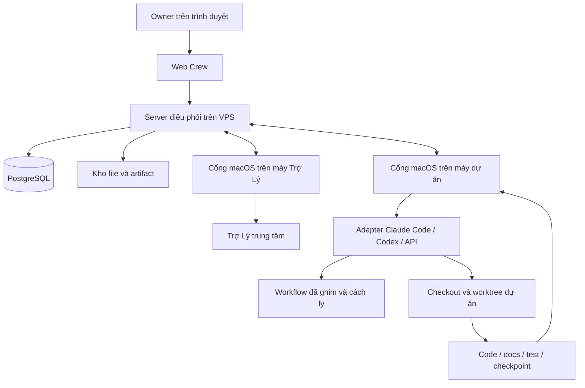

# Crew v2 — Ý tưởng, kiến trúc và cách vận hành

Cập nhật: 04/10/2026, múi giờ Asia/Ho_Chi_Minh.

Tài liệu này giải thích sản phẩm Crew v2 và các yêu cầu bổ sung MVP2 đã chốt. Nó mô tả kiến trúc đích, cách triển khai và cách sử dụng; không phải xác nhận hệ thống đã hoàn thành hoặc đã deploy. Phần 18 phân biệt tình trạng triển khai với kế hoạch. “Crew v2” là ứng dụng viết lại; “MVP2” trong trao đổi là phạm vi bổ sung cho ứng dụng này, không phải một hệ thống khác.

## 1. Crew giải quyết việc gì?

Crew giúp một người quản lý nhiều dự án phần mềm thông qua một Trợ Lý AI. Người dùng giao yêu cầu trên web; Trợ Lý tìm dự án phù hợp, đọc tài liệu, chọn workflow và model, chia ticket, điều phối thực thi trên máy local, review và theo dõi tới khi hoàn thành.

Ví dụ: “Thêm chức năng xuất danh sách học sinh ra Excel cho dự án trường học.” Người dùng không phải tự chọn từng agent, gửi lại context hoặc kiểm tra mọi máy. Crew tổ chức công việc, hiển thị căn cứ và hỏi khi cần quyết định của người dùng.

Sản phẩm kết hợp ba trải nghiệm: quản lý công việc kiểu Jira, không gian tài liệu kiểu Confluence và điều khiển việc thực thi trên máy local. Giá trị cần kiểm chứng là kết quả đạt yêu cầu với ít can thiệp hơn và chi phí chấp nhận được; nhiều agent hoặc ít câu hỏi không tự chứng minh hiệu quả.

## 2. Những lựa chọn đã chốt

- Ban đầu chỉ có một owner. Hỗ trợ nhiều người là hướng mở rộng sau này.
- Web và server điều phối nằm trên VPS; ứng dụng local chỉ hỗ trợ macOS.
- Một dự án thuộc một máy thực thi. Trợ Lý trung tâm chạy trên máy local được owner chọn từ web.
- Hỗ trợ BMAD và Superpowers; Superpowers là mặc định khi owner không chỉ định.
- Các vai trò thực thi dùng official skill của workflow đã ghim, không xây bộ prompt PM/dev/QC riêng.
- Hỗ trợ Claude Code, Codex và OpenAI-compatible API trong pool model của từng máy.
- Tự merge sau nghiệm thu. Deploy cần owner duyệt hành động cụ thể hoặc tạo ticket deploy.
- Tối đa 5 vòng sửa cho cùng bước kiểm tra; vẫn không đạt thì hỏi owner.
- Xử lý sự kiện ngay và kiểm tra vận hành dự phòng mỗi 5 phút.
- Giữ chuẩn docs của v1, nâng kiểm chứng và đồng bộ. Không chuyển ticket, credential hoặc cấu hình runtime v1 vào v2.
- JEV và Archify đã được loại khỏi phạm vi. Understand-Anything cũng không nằm trong kế hoạch graph flow đã chọn.

## 3. Kiến trúc tổng thể

Hai cổng macOS trong hình có thể cùng nằm trên một máy. Kết nối qua server không có nghĩa server được tự chạy shell tùy ý trên máy: hành động phải đi qua giao thức, quyền và adapter đã cho phép.

| Thành phần | Làm gì | Ranh giới |
|---|---|---|
| Web | Hội thoại, board, list, ticket dialog, graph, docs, cấu hình máy/model và duyệt | Không trực tiếp chạy agent hoặc sửa trạng thái DB |
| Server | Trạng thái bền vững, quyền, ticket, event, lệnh, workflow registry và bằng chứng | Không dùng suy luận AI để thay transaction hoặc kiểm quyền |
| PostgreSQL | Dữ liệu nghiệp vụ, journal, quyền thực thi, snapshot và metadata | Không lưu cả checkout source chỉ vì dự án được đăng ký |
| App/cổng macOS | Kết nối, báo sức khỏe, nhận lệnh, quản lý process và runtime | Đóng cửa sổ không được làm mất job |
| Trợ Lý | Hiểu yêu cầu, chọn dự án/workflow/model, chia việc và xử lý vấn đề | Quyết định phải trong phạm vi ủy quyền và có căn cứ |
| Workflow adapter | Đọc định nghĩa bộ đã ghim và chuyển thành bước/gate cần theo dõi | Không thay thế BMAD/Superpowers bằng quy trình tự viết |
| Runtime adapter | Start, checkpoint, resume, cancel, reconcile và thu usage | Không giả định session của runtime khác có thể resume trực tiếp |
| Docs subsystem | Chuẩn, audit, review, snapshot, search và graph flow | Không coi spec dự định là bằng chứng hệ thống đã triển khai |

## 4. Stack triển khai

Repo dùng pnpm và TypeScript. Source v2 hiện nằm độc lập trong thư mục `v2/` ở nhánh triển khai, không import nghiệp vụ/scheduler v1.

| Phần | Công nghệ trong manifest v2 hiện tại | Mục đích |
|---|---|---|
| Domain | TypeScript, Node.js | Hợp đồng trạng thái và quy tắc miền |
| Server | Fastify, thư viện `postgres`, SQL migration | HTTP API, transaction và lưu trạng thái |
| DB | PostgreSQL | Quan hệ, journal, search và graph flow |
| Web | React, Vite, TanStack Router/Query | Điều hướng, dữ liệu server và giao diện |
| Sơ đồ | React Flow (`@xyflow/react`) | Canvas node/edge tương tác |
| Dialog/docs | Radix Dialog, react-markdown, remark-gfm | Ticket dialog và trang tài liệu |
| Desktop | Electron | Cổng macOS và quản lý vòng đời host |
| File extraction | pdfjs-dist, canvas, yauzl, saxes | Các thành phần đọc tài liệu; không đồng nghĩa mọi định dạng đã được nghiệm thu |
| Kiểm thử | Node test runner, PostgreSQL riêng, Playwright | Unit, API/DB và web E2E |

Manifest v2 hiện yêu cầu Node >=24.12 và pnpm 10.32.1. V1 có cấu hình dev PostgreSQL 17; runner test v2 đã khảo sát dùng PostgreSQL 18.6. Đây không phải xác nhận phiên bản production.

## 5. Công cụ nào dùng sẵn, công cụ nào Crew xây?

| Công cụ/lớp | Cách dùng |
|---|---|
| BMAD và Superpowers | Dùng release/skill chính thức, ghim revision/checksum và cách ly nguồn nạp |
| Claude Code và Codex | Dùng runtime của nhà cung cấp qua adapter; kiểm khả năng thực tế trên phiên bản được ghim |
| OpenAI-compatible endpoint | Owner cung cấp endpoint, credential và model; Crew xây vòng agent và tool execution tương thích |
| Git/worktree | Cách ly sửa code, lấy diff/commit và tích hợp; không dùng stash chung trong môi trường nhiều agent |
| `crew-docs` | Chuẩn/CLI đã có từ v1; v2 giữ hợp đồng và nâng validation/review/freshness |
| Workflow manager | Crew xây registry, install/update, kiểm phiên bản, pin run và chặn skill chéo |
| Machine gateway | Crew xây pairing, heartbeat, telemetry, lệnh/ACK và reconciliation |
| Model inventory và router | Crew xây pool theo máy, capability, công tắc nguồn và lưu rationale chọn model |
| Ticket orchestration | Crew xây hierarchy, dependency, decision/input, attempt và cổng hoàn thành |
| Resource registry | Crew xây ownership process/scratch/container/artifact và cleanup có kiểm chứng |
| Attachment pipeline | Crew xây upload tạm, liên kết ticket/comment, extraction và provenance |
| Agent registry | Bổ sung MVP2: tìm session phù hợp, resume/spawn policy và lịch sử vòng đời |
| Usage ledger | Bổ sung MVP2: thu, chuẩn hóa và tổng hợp usage không trùng theo ticket |
| Docs graph | Bổ sung MVP2: cùng dữ liệu project–flow–file–docs–ticket cho người và agent |
| Signed updater | Crew xây drain, chuyển version, health check và rollback gói được ký |

Tên lớp trong bảng là trách nhiệm thiết kế, không phải lời khẳng định mọi API/tool mang tên đó đã có. Hợp đồng chi tiết được chốt trong kế hoạch từng phase. Công cụ chung phải giữ nguyên cổng approval của workflow.

## 6. Một yêu cầu đi qua hệ thống như thế nào?

1. Owner gửi yêu cầu, ảnh và file trên web. Server lưu yêu cầu và đầu vào bền vững.
2. Trợ Lý xác định project, đọc docs cùng commit nguồn và các quyết định trước đó. Nếu mơ hồ hoặc thiếu căn cứ, hỏi owner trong ticket.
3. Chọn workflow theo yêu cầu; mặc định Superpowers. Đánh giá phạm vi, rủi ro, độ phức tạp và thiếu thông tin.
4. Tạo ticket yêu cầu, ticket bước và các ticket công việc khi cần. Lưu dependency, tiêu chí nghiệm thu và đầu ra từng bước.
5. Kiểm máy sở hữu project, nguồn model được bật, workflow version, input capability, telemetry và quyền thực thi trước dispatch.
6. Chọn model phù hợp; kiểm registry để resume hoặc spawn đúng yêu cầu workflow. Agent làm trên workspace có ownership rõ.
7. Worker sửa code/test/docs và nộp bằng chứng. Reviewer độc lập kiểm yêu cầu và chất lượng; findings được trả về để sửa.
8. Xác minh bản ghép cuối với nhánh đích. Nếu đạt các gate thì merge; không đạt thì tiếp tục sửa trong giới hạn hoặc hỏi owner.
9. Đồng bộ docs theo commit đã merge. Ticket yêu cầu hoàn thành khi mọi tiêu chí bắt buộc và docs gate đạt.
10. Dọn tài nguyên run không còn cần, giữ code/docs/artifact và báo cáo. Deploy là hành động riêng được duyệt.

Ví dụ export Excel không nhất thiết cần tất cả bước của feature lớn. Trợ Lý chọn đường phù hợp trong official workflow; không tự bỏ gate chỉ để tạo ít ticket hơn. Yêu cầu nghiên cứu có thể hoàn thành bằng báo cáo thay vì merge code.

## 7. Workflow chính thức và cách ly skill

Superpowers có các đường cho brainstorming, planning, implementation, review, verification; systematic-debugging dành cho bug và spike dành cho khảo sát. Skill thực tế quyết định gate và vai trò tại phiên bản đã ghim.

BMAD được đọc từ release được cài. Chuỗi “spec → story → build → review → QC” chỉ là ví dụ trao đổi, không phải quy trình BMAD cố định được hard-code.

Mọi máy phải cài cả hai bộ, nhưng một phiên thực thi chỉ nhìn thấy bộ đã chọn. Phải kiểm cả skill/plugin từ project, cấu hình user, runtime và agent con; nhắc bằng prompt “đừng dùng bộ kia” không đủ.

Owner cài/update từ web. Run đang chạy giữ version cũ; bản mới cài cạnh bản cũ cho run mới. Máy lệch phiên bản không nhận run mới. Gọi chéo bộ bị chặn, ghi lỗi và báo Trợ Lý.

## 8. Chọn model và tái sử dụng agent

Pool gộp nguồn Claude Code, Codex và API có trên cùng máy. Mỗi ứng viên gồm máy, runtime, model, capability và availability; cùng tên model ở hai nguồn vẫn là hai ứng viên khác nhau.

Ticket ít dòng nhưng đụng auth/migration có thể cần model mạnh. Model chọn dựa vào công việc và bằng chứng, không dựa vào bảng tên hãng cố định. Input ảnh/file yêu cầu capability đọc trực tiếp hoặc extraction phù hợp.

Khi model lỗi/hết quota, Trợ Lý chọn ứng viên khác trên máy project, giữ artifact và reconcile trước khi retry. Hết ứng viên thì chờ với backoff, không chuyển code sang máy khác. Máy Trợ Lý offline thì chờ hoặc owner đổi máy, không tự di chuyển Trợ Lý.

MVP2 ưu tiên dùng lại worker cho cùng task, reviewer cho findings/delta và explorer cho cùng module khi official skill cho phép. Spawn mới khi cần độc lập, song song, context không phù hợp hoặc session không thể resume. Mỗi quyết định có lý do và provenance.

Registry giữ session ID, checkpoint, commit cuối đã đọc, workflow pin, role, ownership và usage. Session rảnh không cần giữ process sống. Resume kiểm quyền và source hiện tại; không mang session giữa project/workflow. Resume vẫn có thể tốn token context.

## 9. Ticket và ba loại sơ đồ

Hierarchy là yêu cầu → bước → công việc. Dependency xác định việc nào sẵn sàng; không ép thành chuỗi tuyến tính. Trạng thái gồm Chờ thực hiện, Sẵn sàng, Đang chạy, Chờ bạn, Tạm dừng, Hoàn thành và Đã hủy. Chờ máy/model/sync là lý do chờ, không phải mỗi lý do một trạng thái mới.

Crew phân biệt:

| Sơ đồ | Trả lời câu hỏi |
|---|---|
| Định nghĩa workflow | Bộ đã ghim quy định các bước/gate nào? |
| Ticket/run chart | Yêu cầu này đang ở đâu, nhánh con phụ thuộc thế nào và đã sửa mấy vòng? |
| Docs flow graph | Flow nào liên quan file, trang tài liệu và ticket nào? |

Board, list và ticket/run chart đọc cùng trạng thái server. Chọn node mở ticket dialog; hỗ trợ pan/zoom/fit và mở rộng công việc con. Docs graph dùng cùng nguồn cho web và agent, có commit/snapshot; không tự nhận là call graph của source hoặc trace runtime.

## 10. Docs là một phần của nghiệm thu

Mọi project dùng cấu trúc `AGENTS.md`, `docs/index.md`, `architecture.md`, `flows.yaml`, `files.md` và `flows/<id>.md`. Trang flow có Mục đích, Điểm vào, Các bước, Files, Dữ liệu, Flow liên quan và Tests.

Manifest ánh xạ source file với flow. Các lệnh của `crew-docs` gồm `init`, `generate`, `where`, `flow`, `check`, `install-hooks` và `ci-workflow`. Agent đọc index, tra flow, đọc tài liệu flow rồi mới mở code liên quan.

V1 đã bắt buộc sửa trang flow cùng code, nhưng R3 chỉ kiểm file docs có được đụng tới. MVP2 yêu cầu review nội dung với diff và giữ bằng chứng theo commit/hash; thay đổi code sau review làm bằng chứng phần ảnh hưởng cần được xét lại.

Snapshot có provenance và trạng thái `missing/unverified/invalid/stale/current`. Imported docs không tự thành verified. UI phải cho biết commit tài liệu phản ánh; stale vẫn đọc được nhưng không giả là mới nhất đã kiểm chứng.

Graph bổ sung quan hệ flow có cấu trúc trong manifest. Một graph snapshot không tự sinh quan hệ từ câu văn để trình bày như dữ kiện chắc chắn.

## 11. Dữ liệu lưu ở đâu và vì sao không cần DB riêng cho mỗi project?

PostgreSQL lưu các project chung trong một hệ thống với project ID và kiểm quyền. Dữ liệu gồm ticket/dependency/comment/decision, machine binding, run/attempt, event/command, docs metadata/snapshot, review evidence và các ledger bổ sung.

Checkout source ở máy project; Crew không nhân toàn source vào PostgreSQL. Docs snapshot là nội dung tài liệu cần đọc/search/audit, không phải backup toàn repo.

Schema docs v2 hiện có lưu byte, search text và search index cho file trong mỗi snapshot. Bổ sung MVP2 sẽ lưu nội dung theo hash, snapshot chỉ tham chiếu file version; nội dung không đổi được dùng lại sau kiểm hash/kích thước/byte. Đây là kế hoạch, chưa phải tối ưu đã triển khai.

Artifact lớn, attachment và transcript theo kế hoạch nằm trong kho file/object storage, DB giữ metadata/checksum/link. Vị trí backend storage cụ thể phải được chốt ở kế hoạch triển khai; không mặc định đã có S3 hoặc dịch vụ nào.

Không tự xóa lịch sử. Dung lượng phụ thuộc số snapshot, tốc độ thay đổi docs, ticket/event và file đính kèm. Cần đo physical storage/index thực tế trước cấp ngân sách; không lấy kích thước source làm dung lượng DB dự đoán.

## 12. Token và chi phí

Runtime adapter thu usage provider trả về, không gọi model chỉ để tính token. Ledger gắn ticket/attempt/session/model và nguồn đo; giữ input/output/cache/reasoning theo semantics provider.

Phải cộng attempt lỗi, retry, review và subagent; không cộng trùng khi resume/replay hoặc khi tổng agent cha đã gồm con. Counter tích lũy cần delta và nhận diện reset. Missing usage là null/partial, không phải 0.

UI tách tổng trực tiếp của ticket và tổng bao gồm ticket con. Điều phối chung không quy thuộc rõ thì vào bucket chung. Chi phí USD ước tính có nguồn/ngày giá; khác với hóa đơn thực tế và quota subscription. Token không tự đổi được ra phần trăm quota tuần.

Lịch sử usage giúp đánh giá chọn model và reuse agent, nhưng partial/estimated phải có nhãn. Đánh giá hiệu quả bằng tổng chi phí hoàn thành, thời gian, vòng sửa và lỗi nghiệm thu; không chỉ đếm số agent.

## 13. Ảnh, file và comment

Owner paste ảnh clipboard, kéo thả hoặc chọn file ngay khi tạo yêu cầu. Upload tạm có preview, tiến độ và retry. Gửi form liên kết attachment với ticket một cách chống trùng; không âm thầm tạo ticket thiếu file upload lỗi.

Comment có cùng khả năng, kể cả comment chỉ có file. Comment mới được ghi bền vững và đánh thức Trợ Lý; không tạo attempt trùng nếu ticket đang chạy.

Trợ Lý phải đọc ảnh, PDF/scan, DOCX, XLSX/CSV và text/code bằng model hoặc extraction phù hợp. Kết luận trỏ về attachment/trang/sheet/vùng khi có thể. File hỏng/có mật khẩu/không hỗ trợ/đọc một phần phải báo rõ.

Giữ bản gốc và provenance; ticket con dùng tham chiếu, không nhân mọi file. Nội dung attachment là dữ liệu, không có quyền thay workflow, cấp quyền hoặc chạy macro/script.

## 14. Chống chạy trùng và phục hồi

Server giữ journal, command identity, lease/fencing và idempotency. Các cơ chế này khác nhau: idempotency tránh nhận cùng thao tác nhiều lần; fencing chặn attempt cũ tiếp tục ghi sau khi quyền thực thi thay đổi; journal giữ lịch sử để khôi phục.

Mất heartbeat không chứng minh process chết. Trước retry phải đối chiếu process, artifact, commit và quyền hiện hành. Một session chỉ có một lượt điều khiển active.

Crash sau merge không được merge lại; xác minh commit rồi tiếp tục sync. Pause/cancel phải tới process thật và có ACK/kết quả, không chỉ đổi nhãn UI. Server lưu inbox khi Trợ Lý offline và xử lý lại khi online.

## 15. Tài nguyên, giám sát và cleanup

Trước mỗi lượt worker/reviewer/fix, lấy telemetry mới gồm CPU/load, RAM khả dụng, memory pressure, disk và job đang chạy. Thiếu hoặc vượt giới hạn thì chờ. Trợ Lý chọn concurrency theo tài nguyên, dependency và ownership, không mở số agent cố định theo CPU.

Việc độc lập có thể song song. Git index/commit/merge, migration và file dùng chung phải serialize hoặc cách ly rồi tích hợp có kiểm chứng. Không kill job đang chạy chỉ để giảm concurrency.

Registry tài nguyên ghi process, scratch, fixture, container và cache do run tạo. Cleanup chỉ dọn tài nguyên đó sau xác nhận process dừng, không còn tham chiếu; giữ workspace có thay đổi chưa lưu và artifact nghiệm thu. Không broad clean thư mục dùng chung.

Sự kiện câu hỏi, model lỗi, step kết thúc, máy offline hoặc version/docs lệch kích hoạt xử lý. Mỗi 5 phút là kiểm dự phòng; không phải cứ 5 phút lại gọi model review toàn bộ hệ thống. Stuck xét hoạt động và timeout phù hợp, không chỉ thiếu dòng log.

Giới hạn quota còn 5% là yêu cầu vận hành được cập nhật trong handover trên main (commit 127a7e2): dừng giao mới, khép việc đã chạy. Không tự quy đổi usage token sang quota để thực thi giới hạn này.

## 16. Owner vận hành hằng ngày

### Thiết lập ban đầu khi v2 đủ nghiệm thu

1. Triển khai server/web và PostgreSQL v2 riêng; backup trước nhập dữ liệu.
2. Cài app macOS, cấp các quyền hệ điều hành cần thiết và pairing máy với server.
3. Đăng ký project, chọn đúng máy và checkout; nhập docs cũ với audit/checksum.
4. Cài đủ BMAD/Superpowers theo version server yêu cầu và kiểm runtime inventory.
5. Cấu hình API/model nếu dùng; bật các nguồn mong muốn trên mỗi máy.
6. Chọn máy/model Trợ Lý từ web. Chạy acceptance project thử nghiệm trước giao việc thật.

Đây là trình tự đích, không phải hướng dẫn deploy một bản v2 đã sẵn sàng. Lệnh/environment cụ thể nằm trong kế hoạch triển khai đã nghiệm thu, không sao chép cấu hình v1 sang v2.

### Giao việc và theo dõi

Owner gửi yêu cầu và file, xem ticket/run chart, trả lời ở Chờ bạn, đọc rationale/model/usage và bằng chứng. Tắt nguồn model trên máy chặn dispatch/fallback mới nhưng không tự kill attempt hiện tại; muốn dừng dùng pause/cancel riêng. Máy offline hiển thị chờ áp dụng cấu hình.

### Deploy và cập nhật local app

Deploy project cần approval/ticket riêng. Update app từ web tải gói ký, kiểm checksum/tương thích, drain job và checkpoint trước chuyển version. Health check thất bại thì rollback; tải xong chưa phải update thành công. Chữ ký ổn định không tự cấp quyền macOS còn thiếu.

## 17. Triển khai theo chín phase

| Phase | Kết quả cần có |
|---|---|
| 01 Domain | Hợp đồng trạng thái, ticket, model, workflow và gate |
| 02 Server/docs | API, DB, identity, journal, execution và docs import/search |
| 03 Gateway | Cổng macOS, telemetry, workflow install/pin/isolation |
| 04 Runtime | Claude/Codex/API adapter, tool loop, pool và fallback |
| 05 Attachment | Upload/link/extraction và truy nguồn nội dung |
| 06 Assistant | Phân tích, authority, workflow run, PM và monitor |
| 07 Web | Hội thoại, ticket UI/chart, docs, máy/model và quyết định |
| 08 Integration | Review/test/docs/merge gates, recovery và sync |
| 09 Operations | Signed update, drain, rollback và release acceptance |

Docs graph/dedup thuộc 02/07/08; usage thuộc 04/06/07/08; agent registry thuộc 03/04/06 và recovery 08/09. Các bổ sung này đã ghi yêu cầu, còn cần kế hoạch task/code và nghiệm thu riêng.

Thực thi theo Superpowers, mỗi task có ownership, test và review. Re-review findings dùng lại reviewer khi workflow cho phép. Tối đa 5 vòng sửa, không reset bằng đổi model/ticket. Tests hẹp chạy trước, mở rộng khi hợp đồng chung thay đổi. UI cần API/DB thật và Playwright evidence; source có không đồng nghĩa hoàn thành.

## 18. Tình trạng và giới hạn của tài liệu

Theo handover 04/10 và ledger đã đọc trong checkout triển khai: domain foundation đã hoàn thành; server/docs và gateway có các phần được review trong phạm vi; assistant authority/schema và artifact inspection có những slice đã nghiệm thu. Một số source checkpoint vẫn thiếu GREEN/re-review/integration. Web shell có evidence nhưng task finalchecks còn pending. Signed updater/operations v2 chưa có nghiệm thu toàn sản phẩm.

Không gọi trạng thái này là “v2 đã chạy đầy đủ”. Tài liệu không chạy lại test hoặc audit production, không đưa phần trăm tiến độ. Tiến độ agent khác làm sau đó phải đối chiếu ledger và Git mới.

`main` chứa nền tảng và tài liệu; nhánh tiếp tục triển khai được bàn giao là `codex/crew-v2-server`. Bản checkpoint có cả source chưa nghiệm thu; push/commit không chứng minh gate đạt. Nội dung trong file này và bổ sung MVP2 đang được lưu ở repo chính, chưa tự đồng bộ sang nhánh triển khai.

## 19. Tài liệu gốc để đọc sâu

- [Thiết kế sản phẩm và kiến trúc v2](superpowers/specs/2026-10-01-crew-v2-design.md).
- [Roadmap chín phase](../plans/261002-0002-crew-v2/plan.md).
- [Bổ sung MVP2: docs, graph, storage, usage và agent lifecycle](../plans/261002-0002-crew-v2/mvp2-docs-storage-usage.md).
- [Handover cho agent tiếp theo](../plans/reports/handover-261004-0913-crew-v2.md).
- [Chuẩn docs Crew](../packages/docs-kit/STANDARD.md).

Spec và bổ sung đã chốt quyết định yêu cầu sản phẩm. Ledger/review/test evidence quyết định trạng thái triển khai. Khi hai nguồn khác nhau, phải ghi rõ khác biệt; không sửa mô tả trạng thái thành hoàn thành chỉ vì tài liệu thiết kế yêu cầu hành vi đó.
