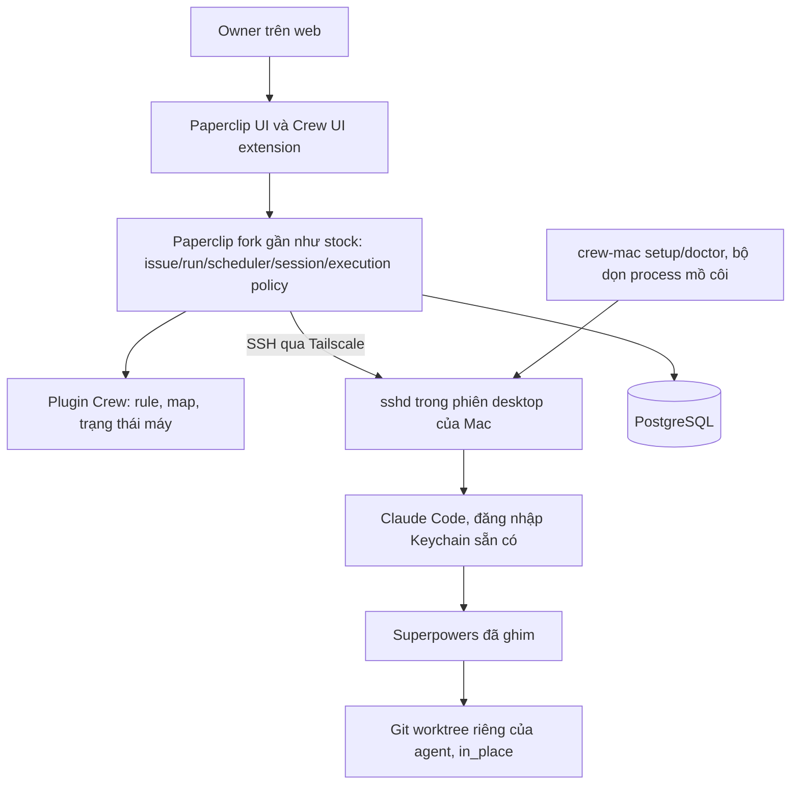

# Crew v3 — Fork Paperclip và lớp mở rộng Crew

Ngày: 05/10/2026, Asia/Ho_Chi_Minh.
Trạng thái: owner đã yêu cầu bắt đầu PM execution trên nhánh `v3` ngày05/10/2026. Phase00 khóa baseline/seams trước implementation; tiến độ và bằng chứng theo [ledger](../../../plans/261005-2154-crew-v3-paperclip/progress.md), chưa có release nghiệm thu.

## 1. Mục tiêu và nguồn yêu cầu

Crew v3 dùng fork `paperclipai/paperclip` làm nền quản lý và thực thi công việc, có đường cập nhật release upstream được kiểm thử. Crew bổ sung Trợ Lý, BMAD/Superpowers, gateway macOS, docs và các chính sách đã chốt.

Kế thừa yêu cầu sản phẩm từ [spec v2](2026-10-01-crew-v2-design.md) và [bổ sung MVP2](../../../plans/261002-0002-crew-v2/mvp2-docs-storage-usage.md). Các ràng buộc nghiệp vụ vẫn giữ; v3 thay ranh giới triển khai server/web/scheduler bằng Paperclip. Không tiếp tục xây một server ticket/scheduler Crew song song với Paperclip.

Đây là kế hoạch mới độc lập. Không tự hủy công việc của agent khác, xóa nhánh v2, merge hoặc deploy trong lượt lập kế hoạch. Audit baseline: main `7c090b8`, v2 `5190785`; source v2 là ứng viên tái dùng, không phải module đã tương thích Paperclip.

## 2. Kiến trúc

Cập nhật 06/10/2026 theo spike stock-first ([báo cáo](../../../plans/261006-0805-crew-v3-stock-first/spike-report.md), [quyết định](../../../plans/261006-0805-crew-v3-stock-first/can-dai-ca-chot.md)): bỏ gateway và transport tự viết, dùng SSH environment có sẵn của Paperclip.

Paperclip trên VPS là lõi duy nhất. Mac là một SSH environment của Paperclip, nối qua Tailscale. Agent `claude_local` chạy ở chế độ `in_place` trong một git worktree riêng trên Mac, không bao giờ trong checkout của owner. sshd dành cho agent chạy dưới LaunchAgent trong phiên desktop để Claude Code dùng được đăng nhập trong Keychain, không cần token và không login lại; vì vậy Mac phải đang đăng nhập desktop. Mỗi project có đúng một máy thực thi; máy quá tải hoặc không vào được thì run nằm chờ trong hàng đợi, không chuyển máy.

## 3. Ai sở hữu dữ liệu và quyền thực thi?

| Dữ liệu/chức năng | Chủ sở hữu |
|---|---|
| Owner login, company, project, issue, comment, attachment gốc | Paperclip |
| Queue, heartbeat run, claim, lifecycle, transcript/session, reported cost | Paperclip |
| Workflow pin, step/gate, dependency bổ sung, repair cycle và completion evidence | Crew namespace, tham chiếu Paperclip ID |
| Machine binding, desired/applied, inventory, telemetry, execution reservation | Crew namespace |
| Docs snapshot/graph/review/dedup | Crew namespace và kho blob |
| Process, worktree, transcript Claude, tài nguyên local | Mac (SSH environment); Paperclip giữ session id và kết quả run. H3 dừng process của run khi trả lease, bộ dọn trên Mac xử lý process mồ côi khi mất mạng |

Trợ Lý đề xuất dự án/workflow/model và gọi official skill để phân rã. Agent chạy BMAD tạo epic/story; agent chạy Superpowers tạo design/plan/task. Controller lưu ánh xạ và kiểm gate; không tự thay nội dung workflow bằng bộ prompt PM riêng.

Paperclip là scheduler duy nhất. Crew không tạo một queue thực thi khác. Kiểm tải máy trước khi claim run bằng hook H1 ở đầu `claimQueuedRun`; máy bận hoặc không vào được thì run giữ `queued`, quá thời hạn thì chuyển trạng thái rõ kèm lý do.

Một bộ invariant phải dùng chung ở mọi đường: UI, API, agent tool, routine, child-task creation và sửa trạng thái trực tiếp. Gate review, docs và owner dùng execution policy có sẵn của Paperclip (giới hạn vòng sửa qua `maxReviewRounds`). Hook H2 ở đầu `runUpdate` chặn ghi `done` khi chưa qua đủ stage và chặn agent sửa hoặc xóa `executionPolicy` (spike đã xác nhận đường lách này). Hook quan sát sau commit không đủ bảo vệ.

## 4. Yêu cầu sản phẩm giữ nguyên

- Một owner ban đầu; UI/docs tiếng Việt, identifier/path tiếng Anh, thời gian Asia/Ho_Chi_Minh.
- Web/server trên VPS; local app macOS là gateway, đóng UI không dừng job.
- Claude Code, Codex và OpenAI-compatible API chung pool theo máy; API có model list do owner cung cấp, tool loop thật. Ba switch độc lập; OFF chặn dispatch/fallback mới, không tự kill lượt đã nhận.
- Chọn model theo độ khó/rủi ro/context/input; lưu rationale. Fallback cùng máy, reconcile trước retry, giữ artifact và capability ảnh/file.
- Mọi máy cài cả BMAD/Superpowers. Superpowers mặc định. Version/revision/checksum chuẩn; pin theo run, update cạnh bản cũ và GC khi hết reference.
- Role/skill chính thức; chặn nạp chéo từ project/user/plugin/subagent bằng cơ chế thực tế. Không gắn cứng chuỗi ví dụ BMAD; adapter công bố workflow/runtime đã chứng nhận.
- Trợ Lý chia ticket theo ngữ cảnh: trước khi cắt, xác định gói ngữ cảnh (file, symbol, doc, môi trường mà agent phải nạp). Hai ticket cùng gói thì gộp làm một; gộp lại quá lớn để review một lần thì giữ nhiều ticket nhưng giao cùng một agent thực thi, nối bằng blocker để chạy lần lượt và dùng chung session. Không giao hai ticket cùng gói cho hai agent song song. Ticket ghi gói của mình; mặc định Paperclip giữ session theo `(agent, adapter, taskKey)` với `taskKey` = issue id, nên cách dùng chung session phải được kiểm ở spike.
- Ticket yêu cầu → bước → công việc; phụ thuộc, gate, findings và sửa tối đa 5 vòng cùng gate, không reset bằng đổi model/ticket. States nghiệp vụ theo spec v2; ánh xạ trạng thái Paperclip được kiểm round-trip, không hiển thị ready/done giả.
- Telemetry trước mỗi worker/review/fix; ownership, capacity và Git/migration serialization; cleanup chỉ tài nguyên thuộc run đã dừng và không còn reference.
- Review độc lập từng task và tích hợp; official workflow quyết định khi nào cần session mới. Agent registry hỗ trợ resume/checkpoint/delta, single-active session, không reuse chéo project/workflow hoặc giả chuyển session giữa runtime.
- Auto-merge sau gate; deploy chỉ khi owner duyệt đúng hành động/target/revision hoặc ticket deploy. Sau merge sync docs đúng commit rồi mới complete.
- Monitor theo sự kiện + mỗi 5 phút, durable inbox, backoff, quyết định có nguồn và hỏi owner đúng gate; không gọi model review toàn hệ thống mỗi 5 phút.
- PM quản lý status mọi ticket/task/parent đã tạo; update đúng state machine và đọc lại xác nhận. Task đủ gate không bị bỏ treo status; pending sync được retry/reconcile/checkpoint. Parent chỉ đóng sau dependency/review/docs gates; mất ACK không chạy lại tác vụ đã hoàn tất.
- Paste ảnh/file trước tạo ticket và trong comment, attachment-only, preview/retry/atomic link; Trợ Lý đọc ảnh/PDF scan/DOCX/XLSX/CSV/text/code, provenance, báo partial/unreadable. Nội dung file không cấp quyền hoặc tự chạy code nhúng.
- Jira/Confluence UX; board/list/ticket dialog; chart request-child/dependency/repair mở dialog; tách workflow definition, actual run graph và docs graph.
- Docs chuẩn Crew, validator cấu trúc/coverage, review với diff, kiểm merged result, trạng thái missing/unverified/invalid/stale/current; graph có project/flow/file/page/ticket cùng API người/agent.
- Docs content-addressed, immutable snapshot, hash+size+byte trước dedup, quyền theo project; DB metadata, blob/file cho dữ liệu lớn; không tự xóa lịch sử, đo logical/physical storage riêng.
- Usage provider-reported theo ticket/attempt/review/retry/subagent, idempotent/cumulative-delta/subset-aware, null/partial khi thiếu; rollup không double count; USD estimate khác billing, token không quy đổi quota subscription.
- Signed remote update macOS, drain/checkpoint, stable signing identity, health/rollback, không tự cấp OS permission.
- Chỉ nhập docs và identity project cần thiết từ v1/v2; giữ nguyên bản nhập, audit trước verified; không nhập ticket/run/credential/machine registration mặc định.
- Không đưa JEV, Archify, Understand-Anything vào phạm vi.

## 5. Extension và fork

Fork giữ lịch sử upstream; `origin` là fork do owner sở hữu, `upstream` là repo chính thức. Đề xuất nhánh `crew/main` cho bản đã nghiệm thu, `crew/develop` cho tích hợp, `sync/paperclip-<release>` cho mỗi đợt update. Tên là đề xuất, chưa tạo branch/repo.

Code Crew ưu tiên package riêng ở `crew/`; mở rộng qua plugin/adapter. Không sửa hàng loạt UI/core chỉ để đổi tên. Public API nối qua một compatibility facade; UI có route extension. Core patch chỉ khi cần invariant mà API không bảo vệ, mỗi patch có file/why/test/upstream issue/commit/removal condition trong registry. Không sửa migration upstream đã áp dụng hoặc đổi checksum để né conflict.

Cách đếm vá (owner chốt 06/10/2026): ngân sách tối đa 5 chỉ đếm hook một dòng có registry ở đầu hàm (hiện H1 `claimQueuedRun`, H2 `runUpdate`, H3 `releaseRunLease` của SSH driver). Vá adapter/driver (claude_local in_place, metadata in_place của SSH driver, `sessionCodec`, dòng log resume) ghi riêng trong `crew/release/core-hooks.json` và gửi PR upstream để giảm dần.

Plugin SDK đang alpha: tài liệu master và release chọn có thể khác nhau. Phase00 phải ghim source SHA/tag/package version và xác minh seam thực tế trước freeze detailed plan. Không hứa merge upstream sạch hoặc hỗ trợ mọi release.

## 6. Cập nhật upstream và rollback

Phát hiện release mới tạo update candidate và diff/report; không tự cài upstream trực tiếp vào production fork. Dùng merge lịch sử vào nhánh sync; không rebase/force-push nhánh production dùng chung.

Mỗi candidate giữ compatibility manifest: upstream tag/SHA, fork SHA, SDK/schema version, Crew package versions, gateway protocol min/max, runtime/workflow pins và patch set. Build artifact có digest; release code/DB/gateway tương thích theo ma trận, không dùng mutable latest.

Pipeline: đọc release notes → fetch đúng tag/SHA → merge vào sync branch → triage conflict/patch → build/test upstream + Crew contracts → migrate bản clone DB đã backup → API/DB/browser + remote run thật → drift/restore tests → review → phát hành staging → owner duyệt deploy → drain và backup production → deploy artifact đã chứng nhận → health/monitor.

Code rollback không undo migration. Nếu schema backward-compatible có thể rollback payload với bằng chứng; destructive migration cần maintenance và restore DB+blob snapshot đồng bộ, có kế hoạch giữ/reconcile write mới. Không restore backup lên hệ đang còn ghi. Gateway cũ không tương thích giữ chờ và hướng dẫn update, không âm thầm làm rơi event/checkpoint.

Workflow update, gateway update và Paperclip core update là ba thao tác riêng. Run đang chạy giữ pin; rollout drain hoặc chuyển quyền chỉ khi protocol đã chứng nhận. Không giả hỗ trợ hot handoff từ tính năng updater upstream.

## 7. Tái dùng v2

Tham chiếu source `5190785`, chọn từng module với test/provenance: domain policy, native process journal/cleanup, telemetry, workflow registry/isolation/render, model broker, docs-kit/validator, extraction và graph UI.

[Bảng tận dụng v2](../../../plans/261005-2154-crew-v3-paperclip/v2-reuse.md) chỉ rõ nguồn, phần giữ/port/thay, release và acceptance. Detailed plan phải ưu tiên module đã có và giải thích nếu viết lại. Giữ nhánh v2/source/evidence làm nguồn đối chiếu; không xóa như scratch và không đánh đồng code reuse với data import.

Danh sách bắt buộc giữ được ghi trực tiếp trong [release plan](../../../plans/261005-2154-crew-v3-paperclip/releases.md#phần-v2-bắt-buộc-giữ-và-chuyển-sang-v3): policy, shell macOS, journal/resource/telemetry/recovery, workflow registry/isolation/render, model broker/runtime contracts, assistant authority/tools, docs-kit/import/read/search/snapshot và nội dung docs dự án, request chart/dialog/docs/machine UI; extractor/corpus/file composer chuyển ở R2. Phần persistence/transport/auth/core ID phải đổi theo Paperclip; phần v2 chưa hoàn thành vẫn là backlog v3.

Không copy DB schema 001–011 của Crew thành second ticket system. Wrapper thay transport/ID/authority sang Paperclip; migration chỉ namespace Crew mới. Module dùng actor/attempt trực tiếp phải đổi contract và re-review. Adapter/native/corpus chưa chứng nhận vẫn có gate, không gắn nhãn accepted vì đã từng có test unit.

## 8. Bằng chứng và điều kiện dừng

Spike stock-first ngày 06/10/2026 đã chứng minh: run do Paperclip tạo chạy trên Mac qua SSH environment và commit trong worktree riêng mà không đụng checkout của owner; gate review/docs/owner chặn đúng; hai issue dùng chung session được; Mac quá tải hoặc không vào được thì run chờ (khi có H1); nâng upstream chỉ vướng một file test. Chưa đạt: khi mất mạng, restart hoặc hủy run, process `claude` trên Mac vẫn chạy tiếp; đây là điều kiện đầu tiên của R1-1 (H3 và bộ dọn process mồ côi), phải chạy lại kịch bản S3 tới khi đạt. Thiếu seam thì ghi patch proposal cụ thể và test, không bù bằng scheduler thứ hai hoặc chỉ prompt.

Nghiệm thu cuối gồm workflow Superpowers, offline/restart/cancel/retry, 5 vòng sửa, owner gate, auto-merge/docs sync, deploy approval, backup/restore và nâng upstream một release. UI dùng Playwright với API/DB thật. Không dùng ticket done hoặc health 200 làm bằng chứng toàn sản phẩm.

## 9. Mốc phát hành

R1 bắt buộc dùng fork Paperclip làm lõi vận hành thật trên VPS: ticket/run/scheduler/session/lịch sử thuộc core, agent trên Mac chạy qua SSH environment và trả kết quả về cùng core ID trên web.

Theo quyết định 06/10/2026, R1/v3.0 làm mỏng: Superpowers × Claude Code chạy xuyên suốt từ text yêu cầu → plan/task → agent trên Mac → review/merge/docs-sync, kèm web/map, backup/restore và nâng fork đã thử. R1 gồm R1-1 nền và kết nối Mac ([plan](../../../plans/261006-1355-crew-v3-r1-1/plan.md)), R1-2 workflow và gate, R1-3 Trợ Lý, R1-4 UI, R1-5 nâng upstream và phát hành. R2/v3.1 thêm BMAD, Codex, API OpenAI-compatible, ảnh/file/comment, docs graph/dedup, usage/reuse nâng cao, app macOS ký số và updater. R1 không bỏ docs/owner/deploy/resource/recovery gate; phần chưa hỗ trợ bị UI từ chối rõ.

Credential AI đặt trên máy Mac thực thi; Claude Code dùng đăng nhập Keychain sẵn có, không token và không bắt login lại. VPS giữ authentication của hệ thống, SSH key vào Mac và secret DB. Ở R1, mỗi lần Claude Code cập nhật bản mới, macOS có thể hỏi lại quyền đọc thư mục được bảo vệ; `crew-mac doctor` phát hiện và hướng dẫn. Ở R2, app macOS ký số đứng ra chạy `claude` để macOS chỉ hỏi quyền một lần cho app.

## 10. Nguồn nghiên cứu

Đọc ngày 05/10/2026; tài liệu là đầu vào khảo sát, không phải chứng nhận release cụ thể.

- [Paperclip repo](https://github.com/paperclipai/paperclip): core orchestration và license.
- [Plugin SDK](https://docs.paperclip.ing/reference/plugins/sdk/): extension worker/UI, SDK alpha và breaking changes.
- [Custom adapter](https://docs.paperclip.ing/reference/adapters/creating-an-adapter/): execute, environment test, session/result contract.
- [Update](https://docs.paperclip.ing/how-to/update-paperclip/): source checkout update, backup và code rollback khác schema rollback.
- [Release notes](https://github.com/paperclipai/paperclip/releases): chọn stable baseline, đối chiếu breaking changes.
