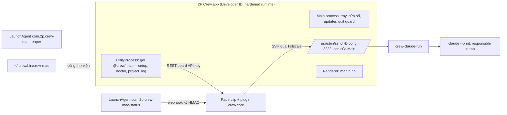

# Crew v3 R2-1 — App macOS ký số bọc `crew-mac` và updater từ xa

Ngày: 09/10/2026, Asia/Ho_Chi_Minh. Trạng thái: spec chờ owner trả lời mục 15, chưa có plan, chưa có code.

Bổ sung cho [thiết kế v3](2026-10-05-crew-v3-paperclip-design.md) §4 ("local app macOS là gateway, đóng UI không dừng
job", "Signed remote update macOS…") và §9 ("Ở R2, app macOS ký số đứng ra chạy `claude` để macOS chỉ hỏi quyền một lần
cho app"), và mục R2 của [kế hoạch stock-first](../../../plans/261006-0805-crew-v3-stock-first/plan.md). Phía Mac hiện
tại: flow [`mac-setup`](../../flows/mac-setup.md), [`mac-orphan-reaper`](../../flows/mac-orphan-reaper.md),
[`mac-workflows`](../../flows/mac-workflows.md). App v2 làm tham chiếu: `my-crew/apps/desktop` (flow v2
`desktop-app`, `runtime-updates`).

Ràng buộc owner đã chốt: Paperclip ghim `v2026.1005.0` tới hết R3, không nâng upstream; app chỉ cần chạy đúng với bản
này. Không thêm hook lõi (ngân sách 5/5 đã dùng: H1–H5). Worker phát triển chỉ dùng Claude.

## 1. Mục tiêu

1. Một app macOS "2P Crew" ký Developer ID và notarize, chạy nền trên Mac thực thi. App sở hữu sshd của agent, nên
   mọi process `claude` do Paperclip sinh qua SSH nhận app làm *responsible process*. macOS hỏi quyền (TCC) cho app một
   lần; Claude Code tự cập nhật không làm hỏi lại.
2. Đóng cửa sổ không dừng job. App thoát, crash hay cập nhật cũng không giết run đang chạy.
3. Thay các lệnh tay bằng màn hình: cài lần đầu (thay `crew-mac setup`), sức khỏe (`doctor`), project, run đang chạy,
   log, cập nhật.
4. Thêm một project từ app: repo trên Mac, project và agent trên Paperclip, ảnh chụp docs, chạy được issue thật.
5. Updater từ xa: app tự kiểm, tải, chờ rảnh, cài, tự kiểm sau cài và quay lui được.
6. CLI `crew-mac` vẫn chạy độc lập, không cần app.

Không làm ở R2-1: UI Crew mới (R3), wizard tạo agent tổng quát (R3), đồng bộ skill (R3), BMAD/Codex (R2 khác), nâng
Paperclip.

## 2. Bằng chứng đã kiểm trên Mac mini (09/10/2026)

Máy: Mac mini arm64, macOS 26.6.2. Chỉ chạy lệnh đọc; một sshd tạm cổng 127.0.0.1:22999 ở chế độ `-d` (tự thoát sau một
kết nối) trong scratchpad, không đụng sshd agent đang chạy.

| # | Câu hỏi | Kết quả | Nguồn |
|---|---|---|---|
| E1 | TCC đang gán quyền cho ai khi agent chạy `claude` qua sshd LaunchAgent? | Cho chính binary `claude` theo **đường dẫn có số phiên bản**: `AUTHREQ_PROMPTING … subject=Sub:{/Users/…/.local/share/claude/versions/2.1.294} Resp:{identifier=com.anthropic.claude-code, responsible_path=…/versions/2.1.294}`. Không có dòng nào nhận `sshd` làm responsible. Đổi bản là đổi subject, nên hỏi lại | `log show --last 14d`, process `tccd` |
| E2 | Khi một app `.app` sinh `claude`, TCC gán cho ai? | Cho app theo bundle id: `subject=Sub:{com.stablyai.orca} Resp:{identifier=com.stablyai.orca … binary_path=…/claude/versions/2.1.294}` (Orca là app Electron sinh `claude`). App v2 `com.2p-solutions.crew` cũng từng là responsible | cùng log |
| E3 | sshd có cắt responsibility của process cha không? | Không. sshd tạm sinh từ một chuỗi process có responsible là Orca: cả `sshd-session` lẫn shell trong phiên SSH đều có responsible = Orca (`responsibility_get_pid_responsible_for_pid`) | thực nghiệm `sshx/` trong scratchpad |
| E4 | sshd agent hiện tại responsible là gì? | Chính nó (pid listener). launchd job không có app cha, nên con cháu không có bundle để TCC gán quyền ổn định | cùng hàm |
| E5 | Binary `claude` có ký ổn định không? | Có (Developer ID Anthropic, `com.anthropic.claude-code`), nhưng là Mach-O trần ngoài bundle nên TCC ghi theo đường dẫn; khớp E1 | `codesign -dv`, `codesign -d -r-` |
| E6 | Keychain có danh tính ký Developer ID chưa? | **Chưa.** Chỉ có `Apple Distribution` (2P SOLUTIONS `J7Y2DL6HZV`, QASOFT) và `Apple Development`. Notarize ngoài App Store cần `Developer ID Application` | `security find-identity -v -p codesigning` |
| E7 | Paperclip chọn environment của run theo gì? | Chỉ theo `agent.defaultEnvironmentId`, rồi mặc định instance, rồi local. Trường `executionWorkspacePolicy.environmentId` của project không được dùng ở bản ghim. Environment SSH `in_place` lấy thư mục từ `remoteCwd` | `server/src/services/execution-workspace-policy.ts` → `resolveExecutionWorkspaceEnvironmentId`; `workspace-realization.ts` |
| E8 | Trên Mac, mỗi agent làm ở đâu? | 5 checkout riêng trong `~/crew-agents/{assistant,integrator,mac-claude,mac-claude-2,reviewer}`, cả 5 cùng origin `repo-a`. Ảnh chụp docs đọc `~/crew-spike/repo-a` (`~/.crew/status-repos.json`) | `ls`, `git remote` |
| E9 | Vai trò reviewer/integrator lưu đâu? | File `CREW_POLICY_CONFIG` trên VPS, **một** reviewer và **một** integrator cho mỗi company | `server/src/crew/issue-policy.ts`, `crew/agents/policy-config.mjs` |
| E10 | App lấy quyền gọi REST Paperclip thế nào mà không sửa lõi? | Stock có luồng `cli-auth`: `POST /api/cli-auth/challenges` trả `boardApiToken` chờ duyệt và `approvalUrl`; owner duyệt trên web, token thành board API key | `server/src/routes/access.ts` |
| E11 | App gửi dữ liệu lên plugin qua đâu? | Webhook `machine-status`, `docs-snapshot` (ký HMAC, chỉ nhận, không trả dữ liệu). Plugin có thể khai `apiRoutes` (capability `api.routes.register`, xác thực board) nếu cần đọc/ghi có trả lời | `packages/crew-plugin/src/manifest.ts`, SDK `PluginApiRouteDeclaration` |
| E12 | Kênh phát hành v2 ở đâu? | GitHub Releases của `nquangphan/my-crew` (public), bản mới nhất `v0.3.1` và `runtime-v0.3.1`. Đây cũng là repo của code v3 | `gh release list`, `git remote -v` |
| E13 | Máy chủ có chặn app tắt không? | H1 coi Mac không vào được là `unreachable`: run giữ `queued` tới hạn rồi mới hết hạn | `server/src/crew/load-gate.ts` |

Kết luận E1–E4: cách chắc chắn nhất để TCC gán quyền cho app là **sshd agent là process con của app**. Không cần
`AssociatedBundleIdentifiers`: khóa đó chỉ đổi cách System Settings hiển thị mục Login Items, không đổi responsible
process. LaunchAgent đăng ký bằng `SMAppService.agent` có thể cũng nhận app làm responsible, nhưng chưa có bằng chứng
nên không chọn.

## 3. Chọn công nghệ

| Tiêu chí | Electron (tái dùng v2) | Swift/SwiftUI native | Tauri |
|---|---|---|---|
| Tái dùng | Main/tray/login item/quit guard/updater/notifications/FDA/codesign của v2; gọi thẳng code TypeScript `@crew/mac` | Không có code sẵn; gọi `crew-mac` qua subprocess | Không có code sẵn |
| TCC | App là responsible của con (E2, chính Orca là Electron) | Như nhau | Như nhau |
| Updater | `electron-updater` + Squirrel.Mac, v2 đã có test | Sparkle, rất chín | Updater riêng |
| Kích thước | ~200 MB | ~10 MB | ~15 MB |
| Notarize | Cần entitlements JIT cho V8 | Đơn giản nhất | Trung bình |
| Người làm | Claude, TypeScript như toàn repo | Claude viết Swift được, nhưng là ngôn ngữ thứ hai cần review | Rust, thứ ba |

Khuyên **Electron**. Lý do: tái dùng phần shell v2 đã có test, và chạy `@crew/mac` như thư viện ngay trong app (một
nguồn sự thật với CLI). Kích thước không quan trọng với một máy. Không tái dùng `daemon-host`, `RuntimeManager` (cập
nhật nóng runtime) và renderer v2, vì v3 không có daemon và server riêng.

## 4. Kiến trúc

- Bundle id `com.2p-solutions.crew.mac`, tên hiển thị "2P Crew". Khác bundle id v2 (`com.2p-solutions.crew`) để không
  thừa hưởng quyền TCC, login item và cache updater của app v2.
- **Main process** sinh `sshd` bằng đúng file cấu hình hiện có `~/.crew-mac/sshd/sshd_config` (host key, cổng 2222,
  `ListenAddress` IP Tailscale, `AllowUsers`, chỉ key). Paperclip không phải đổi gì: cùng host, cổng, host key.
  Main giữ pid, đọc `sshd.log`, khởi động lại khi sshd chết (backoff 1s → 60s).
- **LaunchAgent reaper và status giữ nguyên.** Chúng không cần TCC và nên chạy cả khi app tắt: status báo máy (kèm
  "sshd không chạy"), reaper dọn run mồ côi khi phiên SSH mất.
- LaunchAgent `com.2p.crew-mac-sshd` bị gỡ khi chuyển sang app (mục 7). Cổng 2222 chỉ có một chủ tại một thời điểm.
- **utilityProcess** chạy các thao tác dài (doctor, clone, REST) để không khóa cửa sổ. Không giữ job: đóng hay crash
  không ảnh hưởng run.
- App mở cùng máy (login item, `app.setLoginItemSettings` → `SMAppService.mainApp`), mở từ login item thì chỉ hiện
  tray. Mac phải tự đăng nhập desktop như hiện nay.
- Dữ liệu riêng của app: `~/Library/Application Support/2P Crew/` (`app.json` trạng thái cài, `app.log` JSON Lines
  xoay 10 MB, `previous/` bản trước để quay lui). Secret chỉ trong Keychain: board API key (service
  `crew-mac-paperclip`), webhook secret giữ như hiện nay (service `crew-mac-status`). Không dùng Electron `safeStorage`,
  vì CLI và LaunchAgent status cũng phải đọc cùng secret; app dùng `security` như CLI và chịu chung rủi ro `-w` (mục 14).

## 5. TCC: quyền gắn với app

- Mọi `claude` của run có chuỗi cha: app → sshd → `sshd-session` → shell → `crew-claude-run` → `claude`. Theo E3 cả chuỗi
  nhận app làm responsible, nên TCC hỏi và ghi quyền cho `com.2p-solutions.crew.mac` theo designated requirement của
  Developer ID (ổn định qua mọi bản app và mọi bản Claude).
- Màn hình cài đặt có bước **Quyền ổ đĩa**: dò Full Disk Access không gây hộp thoại (port `full-disk-access.ts` v2: đọc
  thử `~/Library/Safari` và `TCC.db`), nút mở đúng pane System Settings, dò lại khi cửa sổ được focus. FDA bao cả
  `kTCCServiceSystemPolicyAppData` (loại hộp thoại agent đang gặp, E1). Lựa chọn thay FDA ở câu hỏi Q4.
- Info.plist khai `NSDocumentsFolderUsageDescription`, `NSDesktopFolderUsageDescription`,
  `NSDownloadsFolderUsageDescription`, `NSRemovableVolumesUsageDescription` bằng tiếng Việt, để hộp thoại (nếu có) nói rõ
  là agent Crew.
- Keychain không đổi: mục đăng nhập Claude có ACL theo binary `claude`, không theo responsible process; sshd vẫn ở
  trong phiên Aqua của owner (log `setaudit_addr failed` cho thấy sshd chạy bằng user không tạo audit session mới).
- `doctor` thêm check `tcc-owner`: sshd listener có responsible là app (hoặc báo "chế độ LaunchAgent, quyền gắn theo
  bản Claude"). Check `tcc-pending` giữ nguyên, nay hộp thoại của app cũng tính là của agent.

Việc cần chứng minh ở spike đầu R2-1 (mục 12): app mở từ Finder/login item (không phải từ terminal) cho sshd con có
responsible là app; `claude auth status` qua sshd đó vẫn `loggedIn`; hộp thoại TCC hiện tên app.

## 6. Vòng đời và run đang chạy

| Sự kiện | sshd listener | Phiên SSH và run đang chạy | Run mới |
|---|---|---|---|
| Đóng cửa sổ | Chạy | Chạy | Nhận |
| Thoát app (menu/⌘Q) | Quit guard (port v2 `decideQuit`): có run thì hỏi "Chờ run xong rồi thoát" / "Thoát ngay, run vẫn chạy" / "Hủy". Thoát thì gửi TERM cho listener | OpenSSH không giết phiên đã mở khi listener nhận TERM: run chạy tới xong và trả kết quả về Paperclip | Không vào được Mac → H1 giữ `queued` tới hạn (E13) |
| App crash | Listener mồ côi vẫn chạy (reparent về launchd) | Chạy | Vẫn nhận, responsible trỏ về pid app đã chết (spike S4 đo TCC) |
| App mở lại | Đọc `sshd.pid`; listener cũ còn sống thì TERM rồi tự sinh listener mới (cùng cổng). Không bao giờ tăng cổng | Không ảnh hưởng | Nhận |
| Cập nhật app | Như thoát app nhưng có drain (mục 9) | Không ảnh hưởng | Chờ |
| Mất mạng | Như hiện nay: `ClientAliveInterval` cắt phiên, reaper dọn sau 60 giây | | |
| Mac khởi động lại | Login item mở app → sinh listener | Mất (như hiện nay); Paperclip retry theo stock | Nhận khi app lên |

Chỉ dừng process app tự sinh (listener của chính nó, xác định bằng pidfile và argv có `~/.crew-mac/sshd/sshd_config`).
Không bao giờ giết `sshd-session` của run; dừng run là việc của Paperclip (H3 `stop-run`) hoặc reaper.

## 7. Quan hệ với CLI `crew-mac`

- `apps/crew-mac` thành thư viện + CLI: app import các hàm có sẵn (`setup`, `doctor`, `configureStatus`,
  `addStatusRepo`, `stopRun`, `uninstall`…) vốn đã trả kết quả có cấu trúc. Không parse output chữ.
- Thêm vào manifest `sshdOwner: "launchd" | "app"`. `crew-mac setup` mặc định `launchd` như hôm nay (CLI dùng độc lập
  được). App gọi `setup` với `sshdOwner: "app"`: ghi cùng file cấu hình, **không** ghi plist sshd và bootout
  `com.2p.crew-mac-sshd` nếu có. `crew-mac setup --sshd-owner launchd` đưa máy về chế độ không app (đường lui khi app hỏng).
- `doctor` đọc `sshdOwner`: chế độ `app` thì check sshd kiểm listener có phải con của app; app không chạy thì `fail`
  kèm gợi ý "mở 2P Crew".
- App mang theo bản `crew-mac` đã build (`Contents/Resources/crew-mac/`). Khi app bản mới chạy lần đầu và máy rảnh, app
  cài bản đó vào `~/.crew/app/crew-mac` theo cách đang dùng (giữ một bản sao lưu, đổi thư mục atomic) rồi viết lại
  launcher `~/.crew/bin/crew-mac`. Launcher vẫn dùng node Homebrew như hiện nay, để H3 và wrapper gọi qua SSH không phụ
  thuộc đường dẫn bên trong bundle (bundle bị thay khi cập nhật).
- `uninstall` biết chế độ `app`: không còn plist sshd để gỡ; app tự gỡ login item.

## 8. Màn hình tối thiểu

Toàn bộ tiếng Việt, giờ Asia/Ho_Chi_Minh. Tray luôn có: chấm màu sức khỏe, số run đang chạy, "Mở 2P Crew", "Thoát".

1. **Cài đặt lần đầu.** Bước: (a) kiểm macOS, phiên desktop, Tailscale, `claude` đã đăng nhập, Superpowers đúng bản
   ghim; (b) Paperclip: origin (mặc định `https://crew.2p-solutions.com`), nút "Đăng nhập" mở `approvalUrl` của
   `cli-auth`, chờ duyệt, lưu board API key vào Keychain, chọn company; (c) máy: key SSH của Paperclip (dán, hoặc giữ key
   đã có trong manifest), webhook secret (dán, lưu Keychain), cổng, thư mục worktree; (d) Quyền ổ đĩa; (e) chuyển sshd
   sang app; (f) chạy doctor. Máy đã cài bằng CLI (Mac mini) thì bước (c) tự điền từ manifest và `~/.crew/status.json`
   ("Nhận cài đặt có sẵn"), không sinh lại key nào.
2. **Sức khỏe.** Danh sách check của `doctor` (ĐẠT/CẢNH BÁO/LỖI, gợi ý, nút hành động khi có: mở pane quyền, chạy lại
   setup, mở Terminal). Tự chạy mỗi 15 phút với `--no-probe`; probe `claude -p` chỉ khi bấm. Thông báo macOS khi chuyển
   đỏ (port `notifications.ts`).
3. **Project.** Danh sách project của company (REST) ghép với trạng thái trên Mac: checkout của từng agent, repo ảnh chụp
   docs, commit gửi cuối. Nút "Thêm project", "Gỡ khỏi Mac". Chi tiết mục 10.
4. **Run đang chạy.** Đọc bảng process cục bộ (dùng `listProcesses` của reaper): `claude --print` có `PAPERCLIP_RUN_ID`,
   agent (theo worktree), thời gian chạy, số process con. Link mở run trên web. Nút "Hủy run" gọi REST hủy run của
   Paperclip (stock chạy H3), không tự kill.
5. **Log.** Đuôi các file: `app.log`, `sshd.log`, `~/.crew-mac/reaper/reaper.log`, `~/.crew/logs/status.log`; lọc theo
   run id; nút "Mở trong Finder". Transcript run vẫn xem trên web.
6. **Cập nhật.** Bản đang chạy, bản mới, trạng thái (đang tải, chờ rảnh, đã cài, đang thử), nút "Kiểm ngay", "Cài khi
   rảnh", "Quay về bản trước".

## 9. Updater và phát hành

**Kênh.** GitHub Releases của một repo public chỉ chứa bản app (khuyên `nquangphan/crew-mac-releases`, Q2).
`electron-updater` provider `github`, kênh `latest`. Không dùng chung `nquangphan/my-crew`: repo đó đã có "Latest" là
app v2 và `runtime-v*`, updater GitHub chọn theo release mới nhất nên dễ lẫn. Mỗi bản: zip (Squirrel cài), dmg (cài
tay), `latest-mac.yml`, blockmap. Chỉ arm64 (máy thực thi hiện có là arm64); thêm x64 khi có máy x64.

**Ký và notarize trên Mac mini** (Q3). Script `apps/mac-app/scripts/release.mjs`:
1. Kiểm cây git sạch, tag `mac-app/v<semver>` trỏ đúng HEAD.
2. Build `@crew/mac` và app; `electron-builder` với `CSC_NAME` = tên danh tính `Developer ID Application: … (TEAMID)`
   lấy từ Keychain, `hardenedRuntime: true`, entitlements `com.apple.security.cs.allow-jit` và
   `allow-unsigned-executable-memory` (không có native module nên không cần `disable-library-validation`).
3. Notarize bằng `xcrun notarytool submit --keychain-profile crew-notary --wait`, rồi `stapler staple`. Owner tạo
   profile một lần: `xcrun notarytool store-credentials crew-notary` (Apple ID + app-specific password hoặc API key).
4. Tự kiểm: `codesign --verify --deep --strict`, `spctl -a -vv` phải ra `source=Notarized Developer ID`,
   `stapler validate`, designated requirement chứa đúng Team ID.
5. `gh release create` một lần cho tag, tải mọi file lên. Không có secret nào trong repo hay log.

CI (GitHub Actions macOS) để sau: cần xuất `.p12` và secret lên GitHub, ngược ý "owner tự nạp vào Keychain".

**Kiểm và cài.** Kiểm khi mở app và mỗi 1 giờ, cộng nút "Kiểm ngay". Squirrel.Mac kiểm chữ ký bản tải về cùng Team ID
với app đang chạy (cơ chế sẵn của Squirrel); app kiểm thêm phiên bản tăng và tên file đúng kiến trúc. Tải xong thì
**drain**: tạm dừng listener (run mới bị H1 giữ `queued`), chờ hết phiên SSH của run (đếm con của sshd), tối đa 30 phút;
quá thì hỏi owner "Cài ngay, run vẫn chạy" / "Để sau". Khi cài: chép app hiện tại vào `previous/` (giữ 1 bản), Squirrel
thay bundle và mở lại app.

**Tự kiểm sau cài (probation 5 phút).** App mới phải: sinh được listener, `doctor --no-probe` không có `fail` mới so với
trước khi cài, bản tin status gửi được. Hỏng thì thông báo và tự quay về `previous/` (thay bundle, mở lại). Ghi
`app.log` sự kiện `update-installed`, `update-probation-failed`, `update-rolled-back`.

**Quay lui tay.** Nút "Quay về bản trước" dùng `previous/`. Quay lui bản cũ hơn nữa: tải dmg của tag đó trên Releases và
cài tay. Sửa lỗi lâu dài bằng phát hành bản mới số cao hơn (không dùng `allowDowngrade`).

**Báo phiên bản lên web.** Bản tin máy thêm trường tùy chọn `app: { version, sshdOwner, updateState }`. Plugin
(`packages/crew-plugin/src/machines/webhook.ts`, code Crew, không phải lõi) nhận và hiện trên thẻ máy. Bản tin không có
trường này vẫn hợp lệ (CLI độc lập).

## 10. Thêm và gỡ project

**Hiện trạng (E7–E9).** Agent chỉ làm ở `remoteCwd` của environment mặc định của nó, mỗi checkout một repo. Ngoài ra
reviewer và integrator là một cặp cho cả company. Vì vậy "thêm project" không chỉ là tạo một bản ghi project: agent
hiện có đều đang trỏ vào `repo-a`. Mô hình chọn ở Q1; spec dưới đây theo phương án khuyên (B).

**Phương án B — mỗi project một bộ agent riêng, vai trò theo project lưu trong DB plugin.** Kéo việc owner đã duyệt
cho R3 ("vai trò sang DB plugin, chỉ owner sửa") lên R2-1 và mở rộng thành theo project.

Wizard "Thêm project" trong app (mọi bước idempotent, ghi tiến độ vào `app.json`, chạy lại tiếp từ bước dở):

1. Owner nhập URL git (origin) và tên/khóa project; app kiểm `git ls-remote` bằng credential git của owner trên Mac.
2. Mac: clone mirror cho ảnh chụp docs vào `~/crew-projects/<key>` và `crew-mac status add-repo <projectId> <path>`
   (sau bước 3 khi đã có `projectId`); đặt `git config crew-docs.bundle` nếu repo có `docs/flows.yaml`.
3. Paperclip `POST /api/companies/:id/projects`.
4. Với từng vai trò (mặc định: Trợ Lý, 1 executor, reviewer, integrator; owner chọn 1–2 executor): clone checkout riêng
   `~/crew-agents/<key>/<vai trò>` (qua `forbiddenRootReason`), tạo environment SSH `in_place` dùng chung secret SSH đã
   có (`POST /api/companies/:id/environments`, `remoteCwd` = checkout), tạo agent `claude_local`
   (`POST /api/companies/:id/agents`, `command` = wrapper, `extraArgs` = Superpowers ghim, `defaultEnvironmentId`), tải
   `AGENTS.md` của vai trò (`PUT /api/agents/:id/instructions-bundle/file` kèm `baseHash`, port logic
   `add-base.mjs`/`merge-agent-config.mjs`/`render-instructions.mjs`, không chạy shell trên VPS). Trợ Lý nhận danh sách
   executor của project.
5. Vai trò: `PUT` qua plugin API route mới `/api/plugins/crew.core/api/projects/:projectId/roles` (board) ghi bảng
   `crew_project_roles` trong namespace plugin. Code Crew phía server (`server/src/crew/issue-policy.ts`) đọc vai trò
   theo `issue.projectId` từ bảng này trước, không có thì dùng `CREW_POLICY_CONFIG` như hôm nay. Đây là đổi logic bên
   trong hook đã duyệt, không thêm hook mới; cần owner đồng ý (Q1).
6. Kiểm: `doctor` có thêm các worktree mới, `workflow-check` sạch, ảnh chụp docs tới web trong 2 phút.

**Gỡ khỏi Mac.** Tạm dừng các agent của project (`PATCH /api/agents/:id`), archive environment, `remove-repo`, xóa vai
trò trong bảng. Không xóa checkout (giống `uninstall` giữ worktree) và không xóa project trên Paperclip (issue, lịch sử
là của Paperclip); app hiện lệnh xóa thư mục để owner tự chạy.

Cần kiểm ở spike: board API key (từ `cli-auth`) được phép tạo agent và environment; company không bật
`requireBoardApprovalForNewAgents` (nếu bật thì đi `agent-hires` và owner duyệt trên web).

## 11. Chuyển từ app v2

App v2 `/Applications/2P Crew.app` (0.3.0, bundle `com.2p-solutions.crew`, ký tự tạo "2P Crew Code Signing") hiện lỗi
401 vì server v2 đã bị thay. Không có process `crewd` đang chạy. Cách chuyển (bước trong wizard cài đặt, owner bấm xác
nhận):

1. Phát hiện app v2 và login item của nó; nếu đang chạy thì nhờ owner thoát.
2. Sao lưu `~/.crew` phần của v2 (`config.yaml`, `desktop.json`, `settings-cache.json`, `state.db`, `runtime/`,
   `assistant/`, `logs/daemon.log`) vào `~/.crew/v2-backup-<ngày>.tar.gz`, rồi xóa các file đó. Không đụng phần của
   crew-mac (`bin/`, `app/`, `workflows/`, `status*.json`, `logs/status.log`).
3. Chuyển `/Applications/2P Crew.app` vào Thùng rác; `tccutil reset All com.2p-solutions.crew`.
4. Cài app mới vào `/Applications/2P Crew.app` (cùng tên hiển thị, khác bundle id).

App v2 không tự cập nhật sang app mới: kênh phát hành khác repo (mục 9) và bundle id khác.

## 12. Phạm vi R2-1 và thứ tự

Thứ tự, mỗi bước có cổng riêng:

1. **Spike (1 ngày).** S1 app Electron tối thiểu ký Developer ID, mở từ Finder, sinh sshd cổng tạm: responsible của
   phiên SSH là app. S2 `claude auth status`/`claude -p` qua sshd đó. S3 phiên SSH sống qua TERM listener và thoát app.
   S4 TCC: hộp thoại hiện tên app; sau khi cấp, đổi bản Claude (`claude update` hoặc chờ bản mới) không hỏi lại; đo
   hành vi run khi app đã thoát. S5 board API key tạo được agent/environment. Hỏng S1–S3 thì dừng và quay lại so sánh
   phương án (SMAppService agent).
2. **App lõi:** sshd thuộc app, tray, login item, quit guard, cài đặt (nhận cài đặt có sẵn), sức khỏe, run, log; đổi
   `crew-mac` (`sshdOwner`, check mới). Chuyển Mac mini sang app.
3. **Phát hành và updater:** script ký/notarize, repo phát hành, drain, probation, quay lui, trường `app` trong bản tin.
4. **Thêm/gỡ project** theo phương án Q1.
5. **Gỡ app v2.**

Để sau: CI ký/notarize, bản x64, wizard tạo agent tổng quát và đồng bộ skill (R3), helper Keychain native, nhiều máy
Mac, nhận lệnh từ web xuống app (hàng đợi "việc cần làm trên máy" của R3).

## 13. Nghiệm thu

Mọi cổng làm trên Mac mini thật, với Paperclip `v2026.1005.0` đang chạy, bằng chứng ghi vào ledger của plan.

1. **Build/ký/notarize:** `release.mjs` ra zip và dmg; `codesign --verify --deep --strict` đạt; `spctl -a -vv` ra
   `source=Notarized Developer ID`; `stapler validate` đạt. Một GitHub Release có đủ file và `latest-mac.yml`.
2. **Cài trên Mac mini:** mở dmg không có cảnh báo Gatekeeper ngoài "tải từ Internet"; wizard nhận cài đặt có sẵn;
   `launchctl print gui/501/com.2p.crew-mac-sshd` không còn; listener cổng 2222 có cha là app và responsible là app;
   `doctor` không có `fail`; thẻ máy trên web "Trực tuyến" và có phiên bản app.
3. **TCC:** cấp quyền một lần cho app. Đổi bản Claude Code (ghi bản trước/sau). Chạy một issue thật. Trong khung thời
   gian đó `log show` không có `AUTHREQ_PROMPTING` nào có subject là đường dẫn `claude/versions/…` hay bundle app;
   các dòng `AUTHREQ_ATTRIBUTION` của `claude` có responsible `com.2p-solutions.crew.mac`.
4. **Đóng UI không dừng job:** đóng cửa sổ giữa run → run xong `done`. Thoát app giữa run (chọn "Thoát ngay") → run vẫn
   trả kết quả về Paperclip; mở lại app → listener mới, không trùng cổng, không process sshd thừa.
5. **Updater:** phát hành bản N+1; app N tự thấy trong 1 giờ (hoặc bấm kiểm), chờ hết run, cài, mở lại, thẻ máy hiện
   N+1. Một bản cố ý hỏng probation tự quay về N. "Quay về bản trước" hoạt động.
6. **Thêm project:** thêm một repo thật owner chọn từ app; project, agent, environment có trên web; ảnh chụp docs hiện
   trong 2 phút; tạo một issue thật cho project đó trên web, chạy qua Trợ Lý → executor → reviewer → integrator → owner
   tới `done`, commit nằm trên origin của repo đó, không đụng `repo-a`.
7. **CLI độc lập:** trên một tài khoản/thư mục thử, `crew-mac setup --sshd-owner launchd` và `doctor` đạt mà không có
   app; test unit của `@crew/mac` và app đạt; typecheck, lint.
8. **Gỡ v2:** không còn `/Applications/2P Crew.app` bản v2, có file sao lưu, `tccutil` đã reset, không còn login item
   v2.

## 14. Rủi ro và giả định

| Rủi ro / giả định | Ảnh hưởng | Cách xử lý |
|---|---|---|
| Thực nghiệm E3 chạy sshd `-d` từ chuỗi terminal, chưa phải app mở từ Finder | Responsible có thể khác | Spike S1 trước mọi việc khác |
| Run đang chạy khi app đã chết có responsible là pid chết | TCC có thể hỏi lại hoặc từ chối | S4 đo; nếu xấu thì quit guard mặc định "chờ run xong" và drain bắt buộc khi cập nhật |
| Chưa có chứng chỉ `Developer ID Application` (E6) | Chặn cổng 1 | Owner (Account Holder team) tạo chứng chỉ và notary profile trước khi bắt đầu bước 3 |
| FDA cho app nghĩa là agent đọc được mọi file của owner | Rộng quyền | Đã gần như vậy với quyền cấp cho `claude`; Q4 cho owner chọn |
| `security -w` lộ secret ngắn qua `ps` | Như R1 | Giữ, ghi nhận; helper native để sau |
| App tắt lâu thì run hết hạn ở H1 | Run `expire` | Thẻ máy và thông báo cho thấy app tắt; drain tối đa 30 phút, ngắn hơn hạn H1 |
| Hai chủ cổng 2222 (LaunchAgent cũ và app) | sshd không lên | Chuyển chế độ trong một bước có kiểm, `doctor` báo |
| Squirrel.Mac cài thất bại giữa chừng | App không mở | Bundle cũ chỉ bị thay sau khi tải và kiểm xong; `previous/` và dmg trên Releases |
| Phương án B làm Mac chạy nhiều agent hơn | Tải máy | H1 vẫn gate theo máy; mỗi agent `maxConcurrentRuns = 1` |
| Đổi logic đọc vai trò trong `issue-policy.ts` | Gate có thể sai | Fallback file cũ; test round-trip vai trò; chạy lại nghiệm thu gate R1-2 cho project mới |
| Giả định: Mac mini là máy thực thi duy nhất, arm64, luôn đăng nhập desktop | | Như R1 |
| Giả định: Paperclip ghim `v2026.1005.0`, không nâng tới hết R3 | Không cần ma trận tương thích lõi | Theo owner 09/10 |

## 15. Câu hỏi cho owner

**Q1. Thêm project: chia agent thế nào?**
Hiện mỗi agent gắn cứng một checkout `repo-a`, và reviewer/integrator là một cặp cho cả company (E7–E9).
- A. Dùng chung 5 agent hiện có: `remoteCwd` thành thư mục chứa nhiều repo, agent `cd` vào repo theo project của issue.
  Không cần vai trò mới. Nhưng đổi bố cục R1 đã nghiệm thu, đổi instructions của cả 5 agent, skill/CLAUDE.md của repo
  không nạp lúc khởi động, và R3 sẽ phải làm lại.
- B. Mỗi project một bộ agent riêng (mặc định 4: Trợ Lý, 1 executor, reviewer, integrator), vai trò theo project lưu
  trong bảng DB plugin, kéo việc "vai trò sang DB" đã duyệt cho R3 lên R2-1.
- C. Mỗi project một company. Cần sửa file VPS mỗi lần, và bản tin máy chỉ gửi cho một company.
- **Khuyên B:** khớp hướng R3 (wizard tạo agent, vai trò trong DB), cách ly theo project, không đụng bố cục R1, làm
  được hoàn toàn từ app mà không SSH vào VPS. Cái giá là thêm agent và một đổi logic trong code Crew của hook đã duyệt.

**Q2. Kênh phát hành app ở đâu?**
- **Khuyên tạo repo public `nquangphan/crew-mac-releases`** chỉ chứa bản phát hành. Repo `my-crew` đã có "Latest" của
  app v2 và `runtime-v*`, dùng chung dễ làm updater chọn nhầm. Lựa chọn khác: feed trên VPS (thêm việc vận hành).

**Q3. Ký và notarize ở đâu?**
- **Khuyên chạy script trên Mac mini**, chứng chỉ và notary profile nằm trong Keychain như owner muốn; CI để sau.
- Cần owner làm trước: tạo chứng chỉ **Developer ID Application** (Keychain hiện chỉ có Apple Distribution/Development,
  E6) cho team nào (2P SOLUTIONS `J7Y2DL6HZV`?), và `xcrun notarytool store-credentials crew-notary`.

**Q4. Cấp quyền cho app kiểu nào?**
- **Khuyên Full Disk Access một lần** cho "2P Crew": một công tắc, dò được mà không gây hộp thoại, bao cả loại hộp thoại
  "dữ liệu của app khác" agent đang gặp. Lựa chọn khác: chỉ bấm Allow từng thư mục khi hộp thoại hiện (hẹp hơn, nhưng
  vẫn có thể có hộp thoại treo run lần đầu).

**Q5. Dữ liệu app v2 trong `~/.crew` xử lý thế nào?**
- **Khuyên sao lưu thành một file tar rồi xóa** các file của v2 (mục 11), gỡ app v2 và reset quyền của nó. v2 không còn
  server để chạy; giữ nguyên chỉ gây nhầm cho `doctor` và người đọc. Lựa chọn khác: giữ nguyên, chỉ gỡ app.

## 16. Owner đã chốt (09/10/2026)

- Q1: **B** — mỗi project một bộ agent riêng, vai trò theo project lưu trong DB plugin; đồng ý đổi logic đọc vai trò trong `server/src/crew/issue-policy.ts` (không thêm hook).
- Q2: repo public riêng `nquangphan/crew-mac-releases`.
- Q3: ký và notarize trên Mac mini. Owner tự tạo chứng chỉ Developer ID Application và notary profile `crew-notary` trong Keychain; chưa có thì cổng ký/notarize chờ, các phần khác chạy trước.
- Q4: Full Disk Access một lần cho app.
- Q5: **chỉ gỡ app v2**, dữ liệu v2 trong `~/.crew` giữ nguyên (khác phương án khuyên). App mới không được xóa hay sửa file v2.
- Paperclip ghim `v2026.1005.0` tới hết R3.
