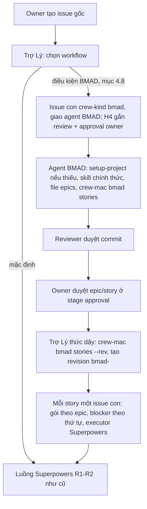

# Crew v3 R2-3 — BMAD: cài, ghim, cách ly; đề xuất epic/story qua Trợ Lý

Ngày: 10/10/2026 00:42, Asia/Ho_Chi_Minh. Trạng thái: spec viết khi owner vắng (owner dặn chạy liên tục, không hỏi).
Quyết định sản phẩm còn mở nằm ở mục 11, mỗi câu có phương án khuyên; [plan R2-3](../../../plans/261010-0030-crew-v3-r2-3/plan.md)
tạm theo phương án khuyên.

Bổ sung cho [thiết kế v3](2026-10-05-crew-v3-paperclip-design.md):
- §3: "Trợ Lý đề xuất dự án/workflow/model và gọi official skill để phân rã. Agent chạy BMAD tạo epic/story; agent
  chạy Superpowers tạo design/plan/task. Controller lưu ánh xạ và kiểm gate; không tự thay nội dung workflow bằng bộ
  prompt PM riêng."
- §4: "Mọi máy cài cả BMAD/Superpowers. Superpowers mặc định. Version/revision/checksum chuẩn; pin theo run, update
  cạnh bản cũ và GC khi hết reference." và "Role/skill chính thức; chặn nạp chéo từ project/user/plugin/subagent bằng
  cơ chế thực tế. Không gắn cứng chuỗi ví dụ BMAD; adapter công bố workflow/runtime đã chứng nhận."
- Mục R2 của [kế hoạch stock-first](../../../plans/261006-0805-crew-v3-stock-first/plan.md): "BMAD (cài, ghim, cách ly;
  đề xuất epic/story qua Trợ Lý)". Dòng tận dụng: hàng "BMAD/Superpowers" của
  [releases.md](../../../plans/261005-2154-crew-v3-paperclip/releases.md) ("map artifact thành ticket core") và hàng
  `v2/gateway/src/workflows/` của [v2-reuse.md](../../../plans/261005-2154-crew-v3-paperclip/v2-reuse.md).

Ràng buộc đã chốt: Paperclip ghim `v2026.1005.0`; hook lõi 5/5 (H1–H5), không thêm hook, không sửa lõi ngoài thân hook
trong `server/src/crew/**`; worker chỉ là agent Claude (không Codex, không fable); quota Claude dùng chung với owner nên
nghiệm thu ít run; R3 (UI Crew mới) đang lập kế hoạch song song nên R2-3 không đụng UI nào ngoài plugin `crew.core`
hiện có (và thực tế không cần sửa plugin).

## 1. Mục tiêu

1. **Cài và ghim.** Mọi Mac chạy `crew-mac setup` có một bản BMAD ghim cạnh bản Superpowers ghim, dưới
   `~/.crew/workflows/bmad/<version>-<rev12>/`, có version, revision và checksum cây cố định trong code. Nâng bản thì
   bản mới nằm cạnh bản cũ; bản cũ bị dọn khi không còn run nào dùng.
2. **Cách ly.** Run của agent BMAD chỉ nạp đúng bản BMAD ghim; run của agent khác chỉ nạp đúng bản Superpowers ghim.
   Không run nào nạp skill từ `~/.claude`, từ plugin owner cài, hay từ workflow kia qua `enabledPlugins` của repo.
   Phần BMAD đặt trong repo (`_bmad/scripts`, `_bmad/config.toml`, `_bmad/custom`) chỉ được nạp khi đã commit sạch,
   riêng script phải giống từng byte bản ghim.
3. **Công bố workflow đã chứng nhận.** `crew-mac workflows list --json` in danh sách workflow Crew chứng nhận trên máy
   đó (id, version, revision, checksum, runtime `claude_local`, mặc định hay không, đã cài chưa). Doctor và trạng thái
   máy trên plugin có check `bmad-pin`.
4. **Đề xuất epic/story qua Trợ Lý.** Với yêu cầu cần lập epic/story, Trợ Lý tạo một issue con `crew-kind bmad` giao
   agent BMAD. Agent BMAD dùng skill chính thức của BMAD (không theo chuỗi gắn cứng) để ra file epic/story trong repo.
   Owner duyệt epic/story ở stage approval của chính issue đó. Sau khi duyệt, Trợ Lý đọc file bằng parser cố định và
   tạo mỗi story thành một issue con có tiêu chí nghiệm thu, gói theo epic, nối blocker theo thứ tự; story được làm
   như mọi issue Crew (executor Superpowers, review, merge, docs). Ánh xạ story ↔ issue nằm trong marker của issue.
5. **Superpowers vẫn mặc định.** Yêu cầu không thuộc điều kiện BMAD (mục 4.8) đi đúng luồng R1–R2 hiện tại.

## 2. Hiện trạng (đọc ngày 10/10/2026)

### 2.1. Superpowers đã ghim và cách ly thế nào (repo Crew, nhánh `r2-2` @ `a0e8ed8`)

Theo [`docs/flows/mac-workflows.md`](../../flows/mac-workflows.md) (trên `r2-2`) và `apps/crew-mac/src/workflows/**`:

- `SUPERPOWERS_PIN` (`pin.ts`): 6.4.1, revision `5bf4e780…`, checksum cây, danh sách `executables`. Thư mục ghim
  `~/.crew/workflows/superpowers/6.4.1-5bf4e7801107`. `installSuperpowersPin` chép từ bản owner đã cài
  (`installed_plugins.json`), kiểm checksum, `rename` nguyên tử; có sẵn mà lệch thì báo lỗi, không ghi đè.
- `treeChecksum`: sha256 của chuỗi `<path>\0<sha256 file>\n` theo thứ tự byte, bỏ `.in_use` ở gốc (chỗ dành cho dấu
  đang dùng, chưa ai dùng).
- `agentExtraArgs(dir)` = `--setting-sources project,local --plugin-dir <dir>`. `extraArgs` được bảo vệ bởi H5: agent
  không sửa được (`agent-config-gate.ts`, key `command`, `extraArgs`, `env`, `model`).
- Wrapper `assets/crew-claude-run.sh`: run Paperclip phải có **đúng một** `--plugin-dir`, rồi gọi
  `crew-mac workflow-check --root "$PWD" --plugin-dir <dir>`; từ chối thì thoát 78.
- `workflowCheck`: `--plugin-dir` phải đúng thư mục ghim Superpowers, đúng checksum, đủ bit thực thi; `discoverSources`
  phân loại nguồn `.claude/**`, `.mcp.json` trong worktree (chưa track/ignore/symlink ra ngoài/sửa dở thì chặn);
  `enabledPlugins` có `superpowers@*` là `pinned` vì run chỉ nạp bản `--plugin-dir` cùng tên (đo 07/10/2026).
- `runInitCheck` + `checkInitEvent`: soát dòng `system/init` của log run: plugin `superpowers` phải có `path` là thư
  mục ghim và đúng version.
- `setup` gọi `installSuperpowersPin` trước mọi bước và in `extraArgs`; `doctor` có check `superpowers-pin` và
  `worktree-workflows`; báo cáo trạng thái máy (`status/report.ts`) gửi kèm `checks` của doctor lên plugin.
- Phía fork (`crew/r2-2` @ `f862b7b20`, đang chạy prod): `crew/agents/apply-roles.sh agent <id> <role> <pin dir>`
  upload `AGENTS.md` theo vai trò và ghim `extraArgs` qua `merge-agent-config.mjs` (regex chỉ nhận
  `<home>/.crew/workflows/superpowers/<…>`); `render-instructions.mjs` nối danh sách executor vào `AGENTS.md` của Trợ Lý.

### 2.2. BMAD hiện có trên Mac mini

- Marketplace plugin `bmad-code-org/bmad-plugins` đã clone sẵn ở `~/.claude/plugins/marketplaces/bmad` (HEAD
  `d009608292d8a2ea4df846de7dca2f0d78a9e22d`, 05/09/2026, "feat(release): build method and toolbox from BMAD-METHOD").
  Hai plugin `bmad-method` và `bmad-toolbox`, cùng version `6.13.0-next`, `strict: false` (không có
  `.claude-plugin/plugin.json` trong thư mục plugin; metadata nằm ở `marketplace.json`). 259 file.
  - `plugins/method/skills/`: 21 skill (`bmad-agent-pm`, `bmad-prd`, `bmad-architecture`,
    `bmad-create-epics-and-stories`, `bmad-build`, `bmad-sprint-planning`, …).
  - `plugins/toolbox/skills/`: 8 skill, trong đó `bmad` (trợ giúp và `bmad setup|update|doctor`, kèm
    `scripts/{setup,resolve_config,resolve_customization,render_skill,memlog,config_utils}.py`).
- Owner **chưa cài** plugin BMAD nào (`installed_plugins.json` không có `bmad*`).
- `uv` 0.12.13 ở `~/.local/bin/uv` (thư mục này đã nằm trong PATH của sshd agent qua khối `~/.zshenv` của `crew-mac`).
- Skill BMAD 6.13 cần thư mục `_bmad/` trong repo dự án: khi kích hoạt, skill chạy
  `uv run {project-root}/_bmad/scripts/resolve_customization.py …` và `resolve_config.py` (đọc `_bmad/config.toml`,
  lấy `planning_artifacts`), và đọc lớp tùy biến `_bmad/custom/<skill>.toml` (nhóm) và `…user.toml` (cá nhân).
  `bmad setup` (`uv run --no-cache <skill bmad>/scripts/setup.py --project-root … --skill …`) tạo `_bmad/` (chép
  `scripts/` byte-identical từ skill `bmad`, ghi câu trả lời module) và chỉ hỏi câu hỏi do module khai báo.
- Skill BMAD thiết kế cho người ngồi trước terminal: "halt at menus and wait for user input", "[C] Continue".
- Định dạng epic/story (`bmad-create-epics-and-stories/templates/epics-template.md`): `## Epic N: <tên>`,
  `### Story N.M: <tên>`, khối "As a / I want / So that", `**Acceptance Criteria:**` với Given/When/Then; luật của
  skill: story trong epic không phụ thuộc story sau ("no future dependency").

### 2.3. Gate và vai trò phía server (fork `crew/r2-2`)

- H4 (`issue-create-policy.ts` → `decideCreatePolicy`): agent chỉ tạo được issue con; issue con luôn nhận template
  `child` = `[review reviewer]`. Board tạo issue gốc nhận `root` = `[review reviewer, review integrator, approval owner,
  review integrator]`, hoặc `research` = `[review reviewer, approval owner]` khi có nhãn `research`.
- H2 (`issue-gate.ts`): gate suy từ hình dạng policy (stage docs = review thứ hai trước approval đầu; stage push =
  review sau approval), không theo nhãn. Template `[review, approval]` không có stage docs/push.
- Vai trò reviewer/integrator/owner đọc từ `CREW_POLICY_CONFIG` (và bảng vai trò theo project của plugin). Executor
  không lưu ở đâu ngoài danh sách nối vào `AGENTS.md` của Trợ Lý.
- Các worktree agent dùng chung kho git (`reviewer.md`: "Worktree của bạn dùng chung kho git với executor"), nên một
  agent đọc được commit của agent khác bằng `git show <sha>:<path>`.

## 3. v2 đã làm gì với BMAD và port được gì

| Phần v2 | Ở đâu | R2-3 | Lý do |
|---|---|---|---|
| "Cài BMAD" từ xa: `npx bmad-method@<version> install --yes --directory <repo> …` chạy trên máy giữ project | `/Volumes/CORSAIR/Projects/my-crew` `apps/desktop/src/daemon-host/bmad-install.ts`, flow `desktop-app` bước 9, `machine-control` | **Không port** | Trình cài cổ điển ghi `_bmad/` và `.claude/skills|commands/` vào repo; `.claude/**` là vùng R6 cần owner duyệt và là nguồn nạp chéo cho mọi agent của repo. Bản 6.13 phát hành dạng plugin, nên skill nạp từ thư mục ghim qua `--plugin-dir`, repo chỉ còn `_bmad/` |
| Hồ sơ `projects.bmad_profile` (jsonb) do máy sở hữu project báo, máy khác cài lại theo hồ sơ | migration `apps/api/drizzle/0007_project_bmad_profile.sql`, `bmad-profile-service.ts`, flow `project-claims` | **Không port bảng** | v2 cần hồ sơ vì `_bmad/` nằm ngoài git ở từng máy. v3 commit `_bmad/` vào repo, nên mọi worktree và mọi máy có cùng cấu hình qua git; không cần bảng Crew, không thêm migration |
| Luật lọc câu trả lời: bỏ khóa cá nhân (`user_name`, `user_skill_level`, `communication_language`), khóa giống credential (`token|secret|password|…`), đường dẫn tuyệt đối/`~`/`..`, ký tự điều khiển | `packages/shared/src/bmad-schemas.ts` (`BMAD_PERSONAL_KEYS`, `BmadSetting`, `OutputFolder`) | **Port** thành hàm thuần `checkBmadAnswers` | `crew-mac bmad setup-project` chỉ truyền câu trả lời cấp nhóm, cố định, không có thông tin cá nhân; parser kiểm `_bmad/config.toml` sau khi dựng |
| Không bao giờ đọc `_bmad/custom`/`_bmad/memory` của máy khác; không bao giờ commit thay owner | `readBmadProfile`, `installBmad` | **Giữ ý** | v3: `_bmad/custom/**` chỉ nạp khi đã commit sạch; lớp `*.user.toml` (cá nhân) bị chặn trừ khi đã commit |
| Ghim nguồn chính thức theo revision, chỉ nhận URL `https` đúng repo/revision | v2 viết lại `a13dd7d` `v2/gateway/src/workflows/pins.ts` (`releases`, `officialSourceUrl`) | **Port ý** | Bản ghim BMAD có `BMAD_SOURCE` cố định (repo `https://github.com/bmad-code-org/bmad-plugins.git`, revision 40 hex); cài chỉ nhận nguồn đó |
| Builder/audit/projection/retention BMAD 6.12 qua npm | `a13dd7d` `builder.ts`, `audit.ts`, `retention.ts` | **Không port** | Gắn với trình cài cổ điển và journal tiến trình v2; v3 dùng `treeChecksum` + dấu `.in_use` sẵn có |
| Probe skill bằng session SDK không gửi turn | `apps/daemon/src/skills/skill-inventory.ts` | **Không port** | v3 đã có `run-init-check` đọc `system/init` của log run thật |

## 4. Thiết kế

### 4.1. Luồng

### 4.2. Bản ghim BMAD

- **Nguồn.** Repo `https://github.com/bmad-code-org/bmad-plugins.git`, revision
  `d009608292d8a2ea4df846de7dca2f0d78a9e22d`, version `6.13.0-next` (Q3). Hai cây `plugins/method/skills` và
  `plugins/toolbox/skills`.
- **Lắp thành một plugin.** Thư mục ghim `~/.crew/workflows/bmad/6.13.0-next-d009608292d8/`:
  - `skills/<tên>/…`: hợp của hai cây skill. Trùng tên giữa hai cây là lỗi cài.
  - `.claude-plugin/plugin.json`: do Crew sinh, nội dung cố định từng byte
    `{"name":"bmad","version":"6.13.0-next","description":"BMAD Method (bmad-method + bmad-toolbox), Crew pin d009608292d8"}` + `\n`.
  - Một plugin, một `--plugin-dir`: wrapper giữ nguyên luật "đúng một `--plugin-dir`", skill có tên `bmad:<skill>`.
  - Checksum ghim (`BMAD_PIN.checksum`) là `treeChecksum` của thư mục đã lắp, tính một lần ở SP-0 và ghi vào code.
- **Cách lấy.** `installBmadPin(ctx)`:
  1. Thư mục ghim có sẵn và đúng checksum: chỉ đặt lại bit thực thi theo `executables`. Lệch checksum hoặc là symlink:
     báo lỗi, không ghi đè (như Superpowers).
  2. Chưa có: dọn `<dir>.tmp-*` cũ; nếu `~/.claude/plugins/marketplaces/bmad` là repo git có object revision ghim thì
     `git -C <đó> archive --format=tar <rev> plugins/method/skills plugins/toolbox/skills`. Không có thì
     `git clone --filter=blob:none --no-checkout https://github.com/bmad-code-org/bmad-plugins.git <tmp>` rồi `archive`
     cùng lệnh. Không đọc HEAD hay working tree của marketplace (owner cập nhật marketplace không ảnh hưởng).
  3. Giải nén vào `<dir>.tmp-<pid>`, lắp `skills/`, ghi `plugin.json`, kiểm checksum, đặt bit thực thi, `rename`.
  4. Không ghi gì dưới `~/.claude`.
- **`setup`** cài cả hai bản ghim (Superpowers trước, BMAD sau; lỗi BMAD dừng setup với hướng dẫn, đúng yêu cầu "mọi
  máy cài cả hai") và in hai dòng `extraArgs`: một cho vai trò thường, một cho vai trò `bmad`.
- **`crew-mac workflows install`** chỉ cài hai bản ghim và in hai dòng `extraArgs`, không đụng sshd/launchd/zshenv. Dùng
  khi deploy lên máy đang chạy (sshd agent do app `2P Crew` giữ từ R2-1), để không chạy lại cả `setup`.
- **`doctor`** thêm check `bmad-pin` (có, đúng checksum, đủ bit thực thi) và `agent-uv` (`uv` chạy được với PATH của
  sshd agent). Hai check đi lên plugin qua `checks` của báo cáo trạng thái máy sẵn có, không đổi schema webhook.

### 4.3. Workflow đã chứng nhận

`apps/crew-mac/src/workflows/registry.ts` là nơi duy nhất liệt kê workflow Crew nhận:

| id | Bản ghim | Plugin | Runtime | Mặc định | Dùng cho |
|---|---|---|---|---|---|
| `superpowers` | `SUPERPOWERS_PIN` 6.4.1 | `superpowers` | `claude_local` | có | design/plan/task, code, review, merge |
| `bmad` | `BMAD_PIN` 6.13.0-next | `bmad` | `claude_local` | không | epic/story |

`crew-mac workflows list [--json]` in bảng này kèm trạng thái cài trên máy. Tên plugin của bản ghim trùng `id`
(`checkInitEvent` sẵn có so tên plugin với `pin.workflow`). Runtime khác (`codex_local`,
`opencode_local` của R2-4) chỉ được thêm vào đây khi có bằng chứng chứng nhận riêng. Instructions của agent không gắn
cứng chuỗi skill BMAD (brief → PRD → architecture → epics); agent BMAD dùng skill trợ giúp `bmad:bmad` của chính BMAD để
chọn bước kế tiếp từ hiện trạng repo, mục tiêu cuối là file epic/story qua được parser.

### 4.4. Cách ly

- **Wrapper.** Không đổi luật đúng một `--plugin-dir`; chỉ đổi câu báo lỗi ("bản workflow đã ghim") và thêm dấu
  `.in_use` (4.5).
- **`workflow-check`.** `--plugin-dir` phải là thư mục ghim của **một** workflow trong `CERTIFIED_WORKFLOWS`; pin của
  run là pin đó. Kiểm checksum, bit thực thi, rồi `discoverSources(ctx, root, pin)`.
- **`enabledPlugins` của repo** (`.claude/settings.json` đã commit), theo pin của run:
  - key thuộc workflow của run (`superpowers@*` cho run Superpowers): `pinned` như cũ.
  - key thuộc workflow khác đã chứng nhận (`superpowers@*` trong run BMAD; `bmad@*`, `bmad-method@*`,
    `bmad-toolbox@*` trong mọi run): `blocked`, lý do `bật workflow <id> khác với workflow của run (nạp chéo)`. Cách sửa
    in kèm: bỏ key đó khỏi `enabledPlugins` hoặc giao issue cho agent của workflow đó. Lý do: tên plugin khác bản ghim
    thì Claude nạp bản trong cache owner (không ghim).
  - plugin khác: `project` như cũ.
- **`_bmad/` trong repo** (chỉ xét khi pin là `bmad`):
  - `_bmad/scripts/**`: đã commit sạch **và** giống từng byte `<pin>/skills/bmad/scripts/**` → `project`; chưa commit
    nhưng giống từng byte → `pinned` (run trước bị ngắt sau `setup-project`); khác → `blocked`
    (`khác bản ghim; chạy crew-mac bmad setup-project`). Đây là code mà skill chạy bằng `uv run`.
  - `_bmad/config.toml`, `_bmad/custom/**/*.toml` (trừ `*.user.toml`): đã commit sạch → `project`; chưa track, bị
    ignore, sửa dở → `blocked` kèm lệnh xử lý như nguồn `.claude`.
  - Mọi `*.user.toml` dưới `_bmad/`: `blocked` trừ khi đã commit sạch (lớp cá nhân là đường nạp từ "user").
  - Run Superpowers không xét `_bmad/` (không skill nào của nó chạy các file này).
- **`run-init-check`** nhận pin theo plugin có trong `system/init`: run BMAD phải có plugin `bmad` với `path` là thư mục
  ghim BMAD và đúng version, không có `superpowers`; run Superpowers giữ luật cũ và có thêm luật không có `bmad`. Skill
  `bmad:<tên>` được phép khi plugin `bmad` được phép.
- **Không đổi:** `--setting-sources project,local` (không nạp `~/.claude`), luật `.claude/**`, MCP, `BUILTIN_*`.
- **`doctor` `worktree-workflows`** quét như cũ với pin Superpowers (doctor không biết worktree nào của agent BMAD); luật
  `_bmad/` được kiểm lúc run bằng `workflow-check`.

### 4.5. Pin theo run và dọn bản cũ

- Pin của một run là thư mục `--plugin-dir` mà `workflow-check` đã chấp nhận. Dòng `crew-workflow ok` đổi thành
  `crew-workflow ok pin=<id>@<version> rev=<rev12> sum=<checksum12> project=<n> pinned-dup=<n>` và nằm trong log run
  Paperclip (stderr), làm bằng chứng run dùng bản nào.
- Sau khi `workflow-check` qua, wrapper ghi `<pin dir>/.in_use/<PAPERCLIP_RUN_ID>` nội dung `<pid> <started>` (cùng
  `started` với file của reaper). `treeChecksum` đã bỏ `.in_use` ở gốc nên checksum không đổi.
- Nâng bản: sửa hằng số pin, cài `crew-mac` mới, chạy `setup` (thư mục mới nằm cạnh), `apply-roles.sh` cập nhật
  `extraArgs` của agent. Run đang chạy giữ thư mục cũ.
- `gcWorkflowPins(ctx)`: với mỗi thư mục dưới `~/.crew/workflows/<id>/` khác thư mục ghim hiện hành của `<id>`: xóa dấu
  `.in_use/*` có pid đã chết hoặc cũ hơn 7 ngày; còn dấu sống thì giữ; không còn dấu và thư mục không đổi trong 24 giờ
  thì xóa. Không bao giờ xóa thư mục ghim hiện hành. Gọi ở cuối `setup`, ở `crew-mac workflows gc`, và trong `reap`
  tối đa một lần mỗi giờ (dấu thời gian `~/.crew/state/workflows-gc.stamp`).
- Agent còn trỏ thư mục cũ sau khi `crew-mac` mới cài: `workflow-check` chặn ngay (không phải bản ghim hiện hành), nên
  "hết reference" trên Mac = không còn run sống dùng thư mục đó.

### 4.6. Dựng BMAD trong repo dự án

- `crew-mac bmad setup-project --root <worktree>` chạy `uv run --no-cache <pin>/skills/bmad/scripts/setup.py
  --project-root <root> --skill <pin>/skills/bmad` không tương tác: lấy danh sách câu hỏi module
  (`--list-config-questions`), nhận đúng giá trị `default` script trả, riêng ngôn ngữ giao tiếp và ngôn ngữ tài liệu là
  `Vietnamese`, rồi chạy setup với file câu trả lời tạm 0600 (xóa sau). Không truyền khóa cá nhân; câu trả lời đi qua
  `checkBmadAnswers` (port v2). Sau khi xong: `_bmad/scripts/**` phải giống từng byte bản ghim; không được có
  `*.user.toml` (có thì xóa); in danh sách file mới để agent commit.
- Đã có `_bmad/scripts/resolve_config.py` thì không làm gì (không update, không hạ cấp), như v2 "luôn `skipped`".
- Repo có `_bmad/` kiểu trình cài cổ điển (6.0, `_bmad/_config/manifest.yaml`, chưa có `_bmad/scripts`): setup 6.13
  để nguyên file cổ điển và thêm `scripts/`, `config.toml` (theo `references/setup.md` của skill `bmad`).
- Cách gọi script, tên cờ và file nó ghi được SP-0 đo (giả định A2); không đo được thì agent BMAD chạy `bmad setup`
  bằng chính skill, phần kiểm sau đó giữ nguyên.

### 4.7. Agent BMAD

- Một agent `claude_local` riêng cho mỗi project dùng BMAD (AC: `repo-a`), `extraArgs` = `agentExtraArgs(<pin BMAD>)`,
  instructions `crew/agents/bmad.md`, worktree riêng `~/crew-agents/bmad` cùng kho git với các agent khác, environment
  SSH `in_place` riêng. Agent mới theo luật R2-1: `engine: "cli"`, `model` rõ, `env: {}`, `maxConcurrentRuns: 1`.
- `bmad.md` (tóm tắt; nội dung chính xác ở plan):
  - Nhánh `crew/<identifier>` từ `origin/HEAD`; mục "File đính kèm" như các vai khác.
  - Chưa có `_bmad/scripts` thì `setup-project`, commit riêng `chore(bmad): dựng BMAD cho dự án` ngay.
  - Gọi skill `bmad:bmad` (trợ giúp) với mô tả issue để biết skill kế tiếp; chạy skill chính thức theo đúng hướng dẫn
    của nó. Mục tiêu: file epic/story do `bmad:bmad-create-epics-and-stories` ghi ở `planning_artifacts`.
  - Không ai đọc terminal: gặp menu thì chọn tiếp (`C`) nếu đủ dữ liệu; thiếu thông tin chỉ owner biết thì hỏi một lượt
    qua `ask_user_questions` trước khi viết artifact rồi `blocked` và dừng (Q5).
  - Kiểm `crew-mac bmad stories --root "$PWD" --file <file> --json` thoát 0; `workflow-check` sạch; commit; comment
    `crew-commit …` và `crew-bmad-result sha=<40> file=<đường dẫn> epics=<n> stories=<m> digest=<64 hex>` rồi `PATCH done`.
  - Chỉ ghi dưới `_bmad/`, thư mục `planning_artifacts`/`implementation_artifacts` của config, và `docs/` nếu hook
    `crew-docs` của repo đòi (thêm flow mới; không sửa `source`/`shared`/`unassigned`). Không tạo issue, không sửa code
    sản phẩm, không dùng `--no-verify`.
- Reviewer (vai sẵn có, Superpowers) duyệt commit BMAD theo mục mới trong `reviewer.md`: diff chỉ ở đường được phép,
  `crew-mac bmad stories --rev <sha>` thoát 0 và digest khớp comment, `scriptsMatchPin: true`, story có tiêu chí.

### 4.8. Trợ Lý chọn workflow và phân rã

- **Điều kiện BMAD** (Q2): company có ít nhất một agent BMAD (danh sách nối vào `AGENTS.md` của Trợ Lý như danh sách
  executor) **và** yêu cầu là yêu cầu code (không research, không bug) **và** (issue gốc có nhãn `bmad`, hoặc mô tả
  yêu cầu rõ lập epic/story/PRD hay dùng BMAD). Còn lại: Superpowers như hiện nay. Trợ Lý ghi lựa chọn và lý do một
  dòng `crew-workflow id=<superpowers|bmad> reason=<một dòng>` trong comment `crew-plan`.
- **Revision `v1` của nhánh BMAD** chỉ có một con: `child-key=bmad-1`, gói `bmad` seq 1, marker `crew-kind bmad`, giao
  agent BMAD, model `claude-opus-5`/`high` (độ phức tạp `large`: hợp đồng sản phẩm cho cả yêu cầu).
- **H4** gắn cho issue con do agent tạo có dòng `crew-kind bmad` template `bmad` = `[review reviewer, approval owner]`
  (cùng hình dạng `research`, nên H2 không có stage docs/push cho issue này). Agent giả marker chỉ làm issue có thêm
  stage owner, không bỏ được gate nào (Q3).
- **Sau khi con BMAD `done`** (đã qua reviewer và owner), Trợ Lý thức dậy (`issue_children_completed`), thấy con
  `crew-kind bmad` `done` mà chưa có revision `bmad-<identifier con>`:
  1. Đọc comment `crew-bmad-result` mới nhất do agent BMAD (assignee executor của con) viết; kiểm con có
     `completedStageIds` gồm cả stage review và approval.
  2. `crew-mac bmad stories --root "$PWD" --rev <sha> --file <file> --json`; thoát khác 0 hoặc digest lệch → comment
     lỗi trên gốc và dừng.
  3. Ghi kế hoạch revision `bmad-<identifier con>`: mỗi story một con, `child-key=s<N>-<M>`, gói `epic-<N>`
     (`seq` = M), blocker = story trước trong epic; story đầu epic N+1 chặn bởi story cuối epic N (BMAD xếp epic theo
     thứ tự xây dựng). Mô tả: user story nguyên văn + `crew-bmad story=<N.M> source=<sha12>:<file>` + `Tiêu chí nghiệm
     thu:` (mỗi Given/When/Then một dòng `- …`). Executor và model chọn theo luật Trợ Lý hiện có.
  4. Tạo/đối soát con theo đúng máy trạng thái "Ghi kế hoạch → Tạo → Đối soát" sẵn có (khóa
     `crew-child:<id gốc>:bmad-<identifier>:<key>`), nên đánh thức lại không tạo trùng.
- **Ánh xạ** story ↔ issue = marker `crew-bmad story=… source=…` + `child-key`; nguồn sự thật vẫn là issue Paperclip,
  không thêm bảng.
- **Trần:** `BMAD_MAX_STORIES = 30` mỗi file; vượt thì parser báo lỗi, agent BMAD phải tách hoặc hỏi owner (Q5).
- **Đóng gốc:** như hiện nay, khi mọi con của mọi revision `done`; integrator gộp cả nhánh BMAD (artifact) và nhánh
  story.

### 4.9. Hook lõi

Không thêm hook. Chỉ đổi thân H4 trong `server/src/crew/issue-create-policy.ts` (+ `issue-policy.ts`
`buildCrewPolicy("bmad")`) và `description` của H4 trong `crew/release/core-hooks.json`; `anchor`/`head`/`file` giữ
nguyên. Không sửa plugin `crew.core`.

## 5. File dự kiến chạm

- **Repo Crew** (`apps/crew-mac`, flow `mac-workflows`, `mac-setup`, `mac-orphan-reaper`):
  `src/workflows/{pin,registry,bmad-pin,bmad-install,install,inventory,run-init,workflow-gc}.ts`,
  `src/bmad/{epics,answers,setup-project}.ts`, `src/commands/{workflow-check,workflows,bmad,setup,doctor}.ts`,
  `src/reaper/reap.ts` (một lời gọi GC), `src/cli.ts`, `src/context.ts`, `src/context-factory.ts`,
  `assets/crew-claude-run.sh`, test tương ứng, `docs/flows/{mac-workflows,mac-setup,mac-orphan-reaper}.md`,
  `docs/flows.yaml` (khối `mac-workflows`), `docs/files.md` (sinh).
- **Fork** (`crew/r2-3`): `server/src/crew/{issue-create-policy,issue-policy}.ts`,
  `server/src/__tests__/crew-issue-create-policy.test.ts`, `crew/release/core-hooks.json` (description H4),
  `crew/agents/{bmad.md,assistant.md,reviewer.md,render-instructions.mjs,merge-agent-config.mjs,apply-roles.sh}` + test.
- **Không chạm:** `apps/mac-app/**`, `packages/crew-plugin/**`, `ui/**`, lõi Paperclip, Superpowers pin.

## 6. Giai đoạn

0. SP-0 đo trên Mac mini (không run Paperclip): nguồn và checksum bản lắp, nạp `--plugin-dir` (tên `bmad:<skill>`),
   `setup.py` không tương tác, nạp chéo qua `enabledPlugins`, repo AC. Là cổng G0.
1. Mac: ghim + cài + doctor; cách ly; parser/setup-project; GC.
2. Fork: H4 template `bmad`; instructions và script vai trò.
3. Review toàn nhánh, deploy, dựng agent BMAD cho `repo-a`, cài `crew-mac`.
4. Nghiệm thu với một yêu cầu BMAD thật và một yêu cầu Superpowers (chỉ tới comment kế hoạch).

## 7. Tiêu chí nghiệm thu (đo được)

- **AC1 Cài.** Trên Mac mini sau `crew-mac setup`: `~/.crew/workflows/bmad/6.13.0-next-d009608292d8` có checksum đúng
  `BMAD_PIN.checksum`; thư mục Superpowers ghim không đổi checksum; `doctor` `bmad-pin`, `agent-uv` = ok;
  `crew-mac workflows list --json` có 2 workflow, `superpowers.default = true`; thẻ máy trên plugin hiện check `bmad-pin`.
- **AC2 Cách ly (không tốn run).** Trên repo tạm: `workflow-check` với pin BMAD qua khi sạch; chặn (78) khi
  `--plugin-dir` là marketplace/cache owner, khi thư mục ghim bị sửa một byte, khi repo bật `superpowers@…` trong
  `enabledPlugins`, khi `_bmad/scripts/resolve_config.py` khác bản ghim, khi có `_bmad/config.user.toml` chưa commit.
  Với pin Superpowers: chặn khi repo bật `bmad-method@bmad`; `_bmad/` lạ không ảnh hưởng.
- **AC3 Run BMAD thật.** Log run của agent BMAD có `crew-workflow ok pin=bmad@6.13.0-next rev=d009608292d8 sum=…`;
  `crew-mac run-init-check` trên log đó thoát 0, `system/init` có plugin `bmad` path thư mục ghim, không có
  `superpowers`, không skill `~/.claude/skills`.
- **AC4 Trợ Lý chọn BMAD.** Issue gốc nhãn `bmad`: comment `crew-plan` có `crew-workflow id=bmad`, đúng một con
  `crew-kind bmad` giao agent BMAD; `executionPolicy` của con có 2 stage `[review reviewer, approval owner]`.
- **AC5 Agent BMAD.** Commit trên `crew/<identifier>` chỉ đổi đường được phép; có `_bmad/scripts` giống bản ghim và
  file epic/story; comment `crew-bmad-result` khớp `crew-mac bmad stories --rev`; reviewer approve; owner approve trên UI.
  Agent BMAD dùng tối đa 4 run cho issue này (tính cả run sau câu trả lời của owner).
- **AC6 Story thành issue.** Sau duyệt: số con revision `bmad-<id>` = `stories`; mỗi con có `crew-bmad story=N.M`,
  `Tiêu chí nghiệm thu:` không rỗng, gói `epic-N`, blocker đúng chuỗi; giao executor Superpowers; đánh thức Trợ Lý thêm
  một lần (comment owner trên gốc) không sinh con trùng. Executor của `repo-a` được pause (route stock) trước khi owner
  duyệt nên không story nào chạy; owner hủy issue gốc sau đó rồi resume executor (giữ quota).
- **AC7 Mặc định Superpowers.** Một yêu cầu code không nhãn, không nhắc BMAD: `crew-plan` có
  `crew-workflow id=superpowers`, không có con `crew-kind bmad`. Hủy ngay sau comment kế hoạch.
- **AC8 GC.** Thư mục ghim giả bản cũ có dấu `.in_use` của pid sống thì giữ; pid chết và cũ hơn 24 giờ thì
  `crew-mac workflows gc` xóa; thư mục hiện hành luôn còn.
- **AC9 Lõi.** `check-core-hooks.mjs` báo H1–H5, `base` = `v2026.1005.0`; `git diff crew/r2-2..crew/r2-3 --stat` chỉ
  có đường dẫn ở mục 5; plugin không đổi.

## 8. Rủi ro

1. **Bản `-next`.** `6.13.0-next` là kênh phát hành của repo plugin chứ không phải tag stable; skill có thể đổi hành
   vi giữa các commit. Giảm: ghim revision + checksum, không theo HEAD; nâng bản là việc có chủ đích (Q3).
2. **Skill BMAD tương tác.** Run có thể dừng ở menu hoặc hỏi nhiều lượt, tốn quota. Giảm: luật tự chọn tiếp, một lượt
   hỏi, model cố định; AC đo số run.
3. **`uv run --no-cache` cần mạng** (script có thể khai phụ thuộc PEP 723). Mất mạng thì skill rơi về đường tự đọc
   file mà `SKILL.md` đã mô tả ("If the script fails…"). SP-0 đo.
4. **Hook `crew-docs` của repo dự án** có thể đòi file mới `_bmad/scripts/*.py` thuộc một flow. Agent BMAD được thêm
   flow mới; repo không dùng `crew-docs` thì không ảnh hưởng. SP-0 xem `repo-a`.
5. **Đụng R3 đang lập kế hoạch song song.** R3 port script vai trò/template agent vào UI mới và sửa `server/src/crew/**`,
   `apps/crew-mac`. Giảm: R2-3 báo R3 khi các phần đó được ff; nhánh ff sau tự merge và giải xung đột.
6. **App R2-1 tự cài lại `crew-mac` cũ** (rủi ro 4 của R2-2): bản app mang `crew-mac` không có BMAD sẽ đè. Bản app phát
   hành kế tiếp phải build từ nhánh có R2-3. Ghi handover, không sửa app.
7. **Tên skill trong plugin không có `plugin.json` gốc.** Crew tự sinh `plugin.json`; nếu Claude Code đổi cách đặt tên
   skill plugin, `run-init-check` báo `không rõ nguồn` (fail đóng).

## 9. Giả định cần đo ở SP-0

- A1. `git archive` từ marketplace local cho đúng 259 file của hai cây, bit thực thi giữ nguyên; clone `https` cho
  cùng checksum.
- A2. `setup.py` chạy không tương tác bằng cờ trong `references/setup.md`, ghi những file nào, có ghi `*.user.toml`
  không, có cần mạng không, mất bao lâu.
- A3. `claude --setting-sources project,local --plugin-dir <bmad pin>` cho `system/init` có plugin `bmad`, skill tên
  `bmad:<skill>`, không có `superpowers`; kèm repo bật `superpowers@claude-plugins-official` thì Superpowers từ cache
  owner có bị nạp không (lý do cho luật chặn ở 4.4).
- A4. `repo-a` có `docs/flows.yaml`/hook `crew-docs` không; `.claude/settings.json` có `enabledPlugins` gì.
- A5. Skill `bmad:bmad` chạy được không cần người: hỏi "nên làm gì tiếp để có epic và story" trên repo trống trả về
  tên skill.

## 10. Không làm

- Không chạy story bằng workflow BMAD (`bmad-build`, `bmad-sprint-planning`…): code của story luôn qua Superpowers (Q1).
- Không có nút "Cài BMAD" hay màn hình mới; wizard tạo agent BMAD trên web là việc của R3.
- Không đổi template agent trong `apps/mac-app` (project do app tạo chưa có agent BMAD nên luôn Superpowers).
- Không thêm bảng/migration; không sửa plugin `crew.core`.
- Không cài BMAD vào `~/.claude` của owner; không theo dõi update marketplace.
- Không hỗ trợ runtime khác ngoài `claude_local` cho BMAD.

## 11. Câu hỏi cho owner

Plan R2-3 tạm theo phương án khuyên của từng câu. Owner đổi câu nào thì ticket bị ảnh hưởng ghi ở cuối câu.

1. **Phạm vi BMAD.** Khuyên: BMAD chỉ lập epic/story; code từng story vẫn do executor Superpowers làm như mọi issue
   Crew. Phương án khác: story cũng chạy bằng `bmad-build` của BMAD (cần agent BMAD có quyền code, gate riêng, tốn quota
   hơn, R2-3 dài thêm). Ảnh hưởng: AG-1, AC6.
2. **Khi nào dùng BMAD.** Khuyên: Trợ Lý chọn BMAD khi company có agent BMAD, là yêu cầu code, và (issue gốc có nhãn
   `bmad` hoặc mô tả đòi rõ epic/story/PRD/BMAD); còn lại Superpowers; lý do ghi trong `crew-plan`. Phương án khác:
   chỉ theo nhãn `bmad` (owner luôn tự quyết), hoặc Trợ Lý tự đề xuất BMAD cho mọi yêu cầu "lớn" (khó kiểm). Ảnh hưởng:
   AG-1.
3. **Owner duyệt epic/story trước khi tạo issue code.** Khuyên: có, bằng stage approval của chính issue con BMAD (thân
   H4, không hook mới). Phương án khác: Trợ Lý tạo story ngay sau reviewer (nhanh hơn, owner chỉ thấy lúc duyệt gốc).
   Ảnh hưởng: SV-1, AG-1, AC5.
4. **Bản ghim BMAD.** Khuyên: `bmad-code-org/bmad-plugins` revision `d009608292d8` (6.13.0-next, 05/09/2026) đang có sẵn
   trên Mac mini, dạng plugin nạp qua `--plugin-dir`. Phương án khác: chờ tag stable; hoặc trình cài cổ điển
   `npx bmad-method@6.x` như v2 (ghi `.claude/**` vào repo, đụng R6). Ảnh hưởng: MW-1 (hằng số và nguồn).
5. **Hỏi owner trong lúc chạy BMAD và trần story.** Khuyên: agent BMAD tự chọn tiếp ở menu, chỉ hỏi owner một lượt
   (trước khi viết artifact) khi thiếu thông tin mà repo và mô tả không trả lời được; tối đa 30 story mỗi file. Phương
   án khác: mọi menu thành câu hỏi owner (đúng tinh thần BMAD hơn, nhiều run hơn); trần khác 30. Ảnh hưởng: AG-1, MW-3.
