# Crew v3 với lõi Paperclip — Architecture & Release Roadmap

> **Đã bị thay thế ngày 06/10/2026** bởi [kế hoạch stock-first](../261006-0805-crew-v3-stock-first/plan.md). Giữ lại làm tài liệu tham chiếu và bằng chứng.

> **For agentic workers:** REQUIRED SUB-SKILL: Use superpowers:subagent-driven-development (recommended) or superpowers:executing-plans to implement this plan task-by-task. Steps use checkbox (`- [ ]`) syntax for tracking.

**Goal:** Xây Crew v3 trên fork Paperclip, thực thi workflow chính thức qua gateway macOS và cập nhật được upstream mà bảo toàn dữ liệu, policy và job.

**Architecture:** Paperclip sở hữu ticket/run/scheduler/session và lịch sử; Crew sở hữu workflow gate, machine/runtime policy, docs và remote execution bridge. Code Crew tách thành package, core patch có registry/test. Mỗi release fork ghim upstream và được kiểm compatibility trước deploy.

**Tech Stack:** Stack upstream ở release được Phase00 khảo sát; Crew TypeScript/pnpm, PostgreSQL, blob storage, Electron/macOS, Claude Code/Codex/API. Không áp version pnpm/React/Node của v2 lên upstream trước khi đọc manifest.

**Spec:** [Thiết kế v3](../../docs/superpowers/specs/2026-10-05-crew-v3-paperclip-design.md), [v2 requirements](../../docs/superpowers/specs/2026-10-01-crew-v2-design.md), [MVP2 requirements](../261002-0002-crew-v2/mvp2-docs-storage-usage.md).

## Global Constraints

- Owner đã yêu cầu PM thực thi từ 05/10/2026 sau khi tạo skill tro-ly-pm. Làm việc trên nhánh `v3`, giữ nguyên source v2; Phase00 khảo sát/khóa seam trước detailed implementation. Deploy vẫn theo approval/ticket, không push shared branch nếu thiếu quyền.
- Giữ toàn bộ scope spec v3 §4; không lấy Paperclip defaults làm lý do bỏ gate BMAD/Superpowers.
- Một scheduler/run authority; một project/máy; một Trợ Lý thường trực trên máy chỉ định.
- UI/docs tiếng Việt, thời gian Asia/Ho_Chi_Minh; naming code/path theo upstream và quy ước Crew.
- Backup trước mọi schema/data mutation; restore drill là gate, code rollback không giả undo DB.
- Resource check trước mọi implement/review/fix dispatch, kể cả update; tối đa 5 vòng sửa rồi hỏi owner; cleanup chỉ resource thuộc run.
- Phase có source phải có unit/contract, review riêng và acceptance theo scope. Chỉ claim GREEN từ log của exact candidate; UI phải API/DB thật.

## Review Focus

1. Disconnect khi worker vẫn sống: không cấp run replacement hoặc mất pin; thuộc 02/08.
2. Agent/API/routine cố ghi done hoặc chạy trực tiếp: cùng gate trước mutation/spawn; thuộc 00/03/08.
3. Upstream migration làm code cũ không đọc DB mới: rollback restore đúng snapshot và không mất write mới; thuộc 01/10.
4. Model/workflow/user skill đổi khi run đang chạy: pin và quyền vẫn đúng, nguồn OFF không spawn mới; thuộc 03/04.
5. Docs/usage/session dùng cùng ID nhưng sai project/commit: reject access và không double count; thuộc 05/06/08.

## Cách dùng kế hoạch

Đây là roadmap nhiều subsystem, không phải instruction để viết tất cả trong một lượt. Các checklist dưới đây xác định deliverable và acceptance. Mỗi phase phải có detailed implementation plan với exact upstream paths/types/test commands được lấy từ baseline Phase00, failing tests và từng bước nhỏ trước khi viết code phase đó. Không bịa SDK signature hoặc file upstream khi chưa đọc fork.

Phase00 khóa seam và baseline; sau đó review detailed plan theo phase. Không giảm scope ở phase sau chỉ vì prototype chưa hỗ trợ. Giữ progress ledger dưới thư mục kế hoạch này, tách planned/implemented/reviewed/integrated/live-accepted.

## Hai đợt release

Owner yêu cầu đúng **hai đợt release** trong lượt điều chỉnh này. Thay đề xuất năm đợt trước bằng **R1 / v3.0** và **R2 / v3.1**. Mười một phase vẫn là cách chia kỹ thuật, không phải mười một lần phát hành. Các build/fixture/staging nội bộ phục vụ kiểm chứng, không thêm Alpha/Beta release cho owner.

Chi tiết scope, dependency và acceptance ở [release plan](releases.md). Trọng tâm R1 là Crew vận hành thực tế trên fork Paperclip: core quản lý ticket/run/scheduler/session/lịch sử trên VPS, gateway thực thi trên Mac và trả kết quả về cùng core ID. R1 phải giao một yêu cầu text, đọc docs dự án, chạy workflow tới code/review/merge/docs-sync; fork skeleton hoặc adapter prototype chưa đủ phát hành. R2 hoàn thiện ảnh/file, docs graph/dedup, usage/reuse nâng cao, remote updater và toàn scope trên lõi đã tích hợp ở R1. Không đẩy tích hợp Paperclip hoặc quyền/gate/recovery/docs căn bản sang R2 để đạt mốc sớm.

Checklist và Gate của phase05–10 bên dưới mô tả toàn phạm vi cuối phase. Slice A chỉ được ghi complete trong phạm vi R1 đã liệt kê ở releases.md; không đánh dấu phase toàn bộ complete khi B chưa nghiệm thu. Gate R1/R2 trong releases.md là tiêu chí phát hành tương ứng và cùng giữ các invariant chung.

| Đợt | Phase/slice bắt buộc | Kết quả |
|---|---|---|
| R1 — v3.0: Giao việc và hoàn thành | 00–04, 05A, 06A, 07A, 08A, 09A, 10A | Hai workflow, ba runtime, Trợ Lý local, web/map, docs cơ bản verified theo merged commit, auto-merge, monitoring, backup/restore và một vòng nâng fork đã thử |
| R2 — v3.1: Toàn bộ sản phẩm | 05B, 06B, 07B, 08B, 09B, 10B; regression toàn R1 | File/ảnh trên ticket/comment, docs graph/dedup, token rollup/storage stats, reuse policy đầy đủ, signed remote update và toàn bộ acceptance |

Không cộng điểm phase để ước lượng ngày. R1 nằm trên critical path baseline → transport → workflow/runtime → assistant → integrated gates; R2 tận dụng nền đó nhưng vẫn có rủi ro parser/native updater/schema. Sau Phase00 và detailed task breakdown mới đo effort/throughput để chốt thời gian; chưa có dữ liệu để hứa ngày hoặc tỷ lệ công sức chính xác.

## File map đích

Đường dẫn tương đối fork; `crew/` là prefix mới để hạn chế conflict upstream. Phase00 xác nhận workspace convention rồi khóa map trong `implementation-map.md`; nếu upstream cần registration file, ghi exact path và patch tại đó trước triển khai.

| Đường dẫn đề xuất | Ownership/trách nhiệm |
|---|---|
| `crew/contracts/` | ID mapping, protocol, pin/evidence và compat DTO |
| `crew/paperclip-compat/` | Facade SDK/API/schema, status mapping và mutation guard integration |
| `crew/remote-adapter/` | Paperclip execute/testEnvironment/session/result và cancellation |
| `crew/transport/` | Outbound gateway connection, authenticated delivery/ACK/result |
| `crew/gateway/` | Host local, process/worktree/resource journal |
| `crew/desktop/` | Electron shell, onboarding/permission, signed updater |
| `crew/workflows/` | BMAD/Superpowers registry, projection, step/gate mapping |
| `crew/assistant/` | Assistant tools, routing, model selection, monitoring |
| `crew/docs/` | Validator/review/snapshot/search/graph/dedup |
| `crew/usage/` | Usage normalization, Paperclip ingestion adapter và rollup |
| `crew/ui/` | Assistant/workflow/map/docs/machine UI extensions |
| `crew/release/` | Core patch registry, compatibility manifest, update pipeline |
| `crew/tests/` | Cross-package API/DB/remote/browser/update acceptance |

Chỉ một DB instance PostgreSQL; namespace Crew riêng tham chiếu ID core. Không sửa migration upstream đã apply. File source mới phải thuộc docs flow ở repo đích; luật bảo vệ AGENTS/CLAUDE/hook/manifest vẫn tuân theo authorization thực tế, không coi plan là blanket approval.

## 00 — Baseline fork và kiểm chứng extension seam

**Deliverable:** Có quyết định kỹ thuật dựa trên exact stable release và một remote execution proof. Chưa migrate dữ liệu thật.

**Files trước code:** Create `plans/261005-2154-crew-v3-paperclip/baseline.md`, `implementation-map.md`, `phase-00-implementation.md`; trong fork tạo compatibility manifest/contract test theo map đã review.

- [x] Kiểm kê repo/branch v1/v2, giữ checkpoint; không động working tree của agent khác.
- [ ] Lập reuse inventory theo [bảng tận dụng v2](v2-reuse.md): exact source SHA/file/test, phần giữ/port/upstream thay thế/xây mới. Không viết lại module có thể port mà thiếu lý do và review.
- [x] Xác định stable tag + full SHA + license từ upstream; đọc manifest/lockfile và version SDK. Lưu release notes, API/types và checksum baseline, không ghim master mới nhất bằng suy đoán.
- [x] Tạo owner fork `nquangphan/crew-paperclip`, thêm `upstream`, giữ lịch sử Git và làm trên nhánh `v3` theo yêu cầu owner (thay tên branch đề xuất cũ). Exact URL/ref trong baseline và handover.
- [ ] Đọc source issue mutations, run scheduler, execute/cancel/session codec, plugin event/UI surface, auth/storage/migrations. Dùng CodeGraph nếu được index; không index tự động.
- [ ] Viết seam tests trên API/DB disposable: raw API done, worker tool done, routine wake và duplicate run đều qua policy; offline không bị scheduler thay bằng worker thứ hai.
- [ ] Chạy baseline upstream checks từ package scripts đã đọc, lưu exact commands/log/SHA. Lỗi baseline được triage trước phát triển extension.
- [ ] Prototype adapter chạy command scratch trên Mac qua outbound connection; log/session/result/usage metadata trở về Paperclip run thật. Drop connection giữa command, reconnect không spawn lại. Không dùng HTTP 202 như bằng chứng command đã complete.
- [ ] Chứng minh cách reserve capacity trước spawn, cancel tới process thật và cách reconcile sau server restart. Nếu SDK thiếu hook, viết patch proposal exact source/test, dùng fork patch hẹp rồi review lại.
- [ ] Chốt issue hierarchy/state mapping và remote run semantics. Kết thúc với seam PASS hoặc báo cụ thể blocker/patch; không chuyển sang scheduler Crew riêng.

Scoped setup00-03 đã accepted (frozeninstall/preflight/SDK/loader4tests); không đánh dấu checklist baseline rộng hoặc Phase00 xong. Detailedprototypeplan00-06 đang khóa trước00-04 code/proof.

**Gate:** Exact artifact, private DB/API proof, remote process proof, known patch surface và detailed Phase01/02 plan được review. Prototype chưa chứng nhận Claude/Codex/workflow/native isolation.

## 01 — Fork maintenance và compatibility từ đầu

**Depends:** 00. **Owner:** release/compat; không sửa gateway/workflow.

- [ ] Tạo `crew/release` patch registry, manifest schema và contract tests; facade trong `crew/paperclip-compat` được các package khác dùng thay gọi internal trực tiếp.
- [ ] Ghi upstream tag/SHA, fork SHA, SDK/package/schema, protocol range, workflow/runtime pins, artifact digest và core patch set trong mỗi release.
- [ ] Dựng candidate sync branch: fetch tag rồi merge vào develop candidate, không rebase/force-push branch đã phát hành. Mỗi conflict có resolution và reviewer; xóa patch khi upstream đã có behavior tương đương và test đạt.
- [ ] CI chạy upstream checks + Crew contracts + clone DB migration/restore + incompatibility matrix. Có test patch bị mất sau merge phải fail, incompatible SDK không load, old gateway bị giữ chờ.
- [ ] Upstream changelog tạo update report; chỉ build Crew artifact sau review. Chặn updater stock thay payload bằng package upstream làm mất code Crew.

**Gate:** Một update rehearsal trên dữ liệu giả lập có reference/session/gate/docs; code/schema mismatch được chặn. Không auto-deploy release mới.

## 02 — Gateway outbound và Paperclip remote adapter

**Depends:** 00–01. **Owner:** contracts/remote-adapter/transport/gateway/desktop; facade mutation ownership serialize với 03.

- [ ] Khóa protocol `DispatchEnvelope`, `GatewayEvent`, `Checkpoint`, `StopReceipt`: run/issue/project/machine/boot/generation/workflow pin, operation identity, sequence và payload hash. Không tái dùng Crew attempt UUID làm Paperclip run ID.
- [ ] Pairing/credential rotation/revoke; mọi máy chủ động kết nối TLS ra VPS. Heartbeat/telemetry độc lập model. Mỗi project binding có revision; active/uncertain execution chặn rebind.
- [ ] Port journal/launcher/resources/telemetry v2 từng module với source SHA/test/provenance; thay server-specific authority bằng adapter contract. Đóng UI không dừng host.
- [ ] Paperclip là sole run scheduler; transport outbox chỉ delivery, gateway chỉ thực thi đúng grant một lần. Reserve capacity atomically, rollback reservation nếu không spawn, unknown process giữ reservation tới reconcile.
- [ ] Stream logs bằng sequence và replay/dedupe, session/result được persisted theo contract; reconnect/lost ACK/cancel/restart không sinh replacement. Timeout phải phân biệt transport timeout với process đã dừng.
- [ ] Test run qua API/DB thật tới native scratch: sleep online/offline, child process, pause/cancel, revoke, command duplicate, server/gateway restart và cleanup giữ dirty workspace.

**Gate:** Remote lifecycle thật; chưa mở full AI cho tới 03/04. Nếu run adapter phải giữ lâu thì test heartbeat/budget/cancel semantics, không trả success sớm chỉ để tránh timeout.

## 03 — Workflow controller và synchronous gates

**Depends:** 00–02. **Owner:** workflows/controller/facade; docs schema contract phối hợp 05.

- [ ] Cài cả hai release chính thức, desired/applied/checksum/install states, update side-by-side; run pin immutable và retention tham chiếu thật.
- [ ] Workflow catalogue lấy bước/role/gate từ bộ được ghim. Công bố support matrix workflow × runtime; BMAD chưa chứng nhận Codex/API không giả supported, nhưng phải hoàn thiện support yêu cầu trước acceptance cuối.
- [ ] Map request/step/work issue với stable source artifact IDs, dependency/ownership; story/plan do agent official tạo. Publish một graph revision idempotent, reject partial/invalid graph, stage branch lớn để không mở task chưa publish.
- [ ] Chặn nạp skill chéo cả user/project/plugin/subagent; typed source/pin evidence. Execution agent không nhận routing context nạp cả hai workflow.
- [ ] Enforce dependency/owner gate/review vòng/merge/docs conditions trước schedule và complete trên mọi write path; patch lõi hẹp nếu cần. Tối đa 5 semantic repair cycles; infra/model retry không reset.
- [ ] Tests: raw API bypass, self-report pass, stale approval/artifact replaced, parent done trước con, concurrent dispatch, graph rename/replay, update version giữa run và cross-skill canary.

**Gate:** Cả BMAD và Superpowers chạy official planning tới issue graph và pause owner gate đúng; invariants không phụ thuộc agent tuân prompt.

## 04 — Runtime pool, API tool loop và fallback

**Depends:** 02–03. **Owner:** gateway runtime/model packages; không tự mở second scheduler.

- [ ] Runtime/model inventory theo máy, capability tests và ba switch Claude/Codex/API desired/applied. Credential giữ ở máy hoặc broker có quyền; không đưa vào transcript/docs/pool.
- [ ] Claude/Codex adapter dùng process do gateway cấp; native tool/session protocol được nghiên cứu ở phiên bản pin. API dùng owner list models, real tool loop, vision/file compatibility và tool policy.
- [ ] Trợ Lý đề xuất model, policy lọc current binding/source/capability/telemetry. Không hard-code hãng theo task nhỏ/lớn; rationale persisted.
- [ ] Checkpoint/session registry; reuse đúng task/workflow/model compatibility, reviewer độc lập và delta recheck. Fallback reconcile process/artifact/side effect trước replacement, cùng máy.
- [ ] Tests: nguồn tắt khi offline hoặc giữa run, tắt hết nguồn, credential hết hạn, tool-call partial, mất session, cumulative usage, quota/rate-limit backoff, vision fallback, API side effect response bị mất.

**Gate:** Cả ba runtime thực hiện task thật có tool trên scratch; lifecycle/usage/capability evidence. Native sandbox/isolation không cấp PASS từ test mock.

## 05 — Docs chuẩn, graph và storage/import

**Depends:** 01/03 contracts; validator/dedup có thể làm song song 04 sau ownership freeze.

**Release split:** 05A/R1 = validator, docs import/read/search, review evidence, immutable snapshot và sync/freshness theo commit. 05B/R2 = structured graph, content dedup và logical/physical storage reporting. R1 giữ schema/version seam cho B và không thiếu docs gate. R2 migration có backup/restore, không viết lại snapshot lịch sử.

- [ ] Port docs-kit/validator v2 có provenance; kiểm headings/manifest/coverage/generated/links/rename/shared file. Workflow artifacts giữ định dạng gốc.
- [ ] Snapshot/review evidence gắn base/target/merged commit/content hash/project/gate; imported không verified. Đổi code/docs vô hiệu evidence ảnh hưởng.
- [ ] Content-addressed immutable snapshots, hash+size+byte match, project ACL trước blob access; PostgreSQL metadata/index, file store cho blob. Retention không tự xóa lịch sử.
- [ ] Graph project-flow-file-page-issue lấy structured manifest, API chung cho agent/web; không giả call graph từ text. Đo logical/physical/index/blob riêng trên dữ liệu cỡ Crew.
- [ ] Docs import source đọc-only backup/checksum/provenance/idempotency; identity mapping project có owner binding mới. Không nhập v1/v2 credentials/tickets/jobs mặc định.
- [ ] Tests: invalid heading/touch giả, cross-project blob/graph, wrong commit, renamed path, dedup collision mismatch, snapshot cũ, backup+restore và docs-sync sau crash.

**Gate:** Read/search/graph/import thật, trạng thái freshness đúng; semantic verification phải có reviewer evidence, không chỉ hash.

## 06 — Attachment, usage và agent lifecycle integration

**Depends:** 02/04/05 contracts. **Owner:** attachment extraction, usage và session registry có ownership riêng.

**Release split:** 06A/R1 = native session/checkpoint/single-active, worker-reviewer independence, resume cùng task khi workflow cho phép, usage vận chuyển được và nhãn unavailable/partial khi thiếu. 06B/R2 = atomic clipboard/file/comment pipeline, full corpus, normalization/rollup/UI usage và registry policy/context delta đầy đủ. Input R1 chỉ text; UI từ chối rõ ảnh/file, không âm thầm bỏ. Transport R1 phải giữ metadata để R2 không tính lại model usage từ transcript.

- [ ] Dùng Paperclip attachment/comment primitives qua facade; thêm atomic request/comment commit và staging nếu baseline thiếu. Không xây second attachment ownership DB.
- [ ] Port extractors/bounded worker có corpus thật cho image/PDF scan/DOCX/XLSX/CSV/text/code; đọc partial/unreadable có provenance và lỗi rõ. Input không override instruction/tool permission.
- [ ] Usage telemetry đưa vào một nguồn canonical; map Paperclip ingestion với provider counters. Dedupe direct/subagent aggregate/cumulative reset/retry; nếu core ingestion không đủ thì enrich namespace có reference, không cộng hai ledger.
- [ ] Session registry dùng Paperclip session record làm nguồn; Crew thêm workflow/ownership/checkpoint/findings/spawn reason. Single active, không reuse worker làm reviewer hoặc chéo project/workflow.
- [ ] Tests: attachment-only comment/retry/EOF/password/macro, permission revoked, usage missing/null/delta/reset/duplicate, direct vs rollup/shared bucket, session lost/resume conflict/worker-reviewer independence.

**Gate:** Corpus/native extraction được chứng nhận và usage/UI không giả full data. Không thêm model call chỉ để đếm token.

## 07 — Trợ Lý và Crew UI trong Paperclip

**Depends:** 03–06; UI read-only có thể song song từ API contract được freeze.

**Release split:** 07A/R1 phụ thuộc 05A/06A = assistant tools/authority/monitor, designation, máy/switch/workflow warning, board/list/dialog/map có dependency/repair, docs read/search/freshness và text-only acceptance. 07B/R2 phụ thuộc 05B/06B = file composer, docs graph, usage/session/storage views và acceptance ảnh/file. Không để cả phase07 đợi B mới ship R1.

- [ ] Assistant chạy trên Mac owner chọn; tools read projects/docs/state, start workflow planning, assess, ask_owner, request dispatch/review. Tool mutation vẫn đi qua guarded facade.
- [ ] Mọi câu hỏi thiếu nguồn hoặc gate bắt buộc chuyển owner; delegated decisions có source/scope/expiry/hash. Không auto-hire CEO/CTO hoặc nhân bộ custom role Paperclip ngoài workflow Crew.
- [ ] Durable event inbox + routine kiểm dự phòng 5 phút; event dedupe/cursor/claim, trợ lý offline chờ, same-host model fallback. Thắc mắc trong run nhận đúng context mà không dispatch trùng.
- [ ] PM owns ticket/subtask/parent status: workflow state mapping, evidence-before-transition, expected version/idempotency, read-back và lost-ACK reconciliation. Event+5 phút audit phát hiện task đã đạt gate nhưng status chưa cập nhật; pending sync có retry/owner/checkpoint, không close hoặc bỏ ticket mồ côi. Chứng minh timeout sau terminal mutation không rerun execution; parent không done trước review/docs/dependency gates.
- [ ] UI assistant/attention, model/machine designation, three switches/install/update warnings; board/list/dialog dựa cùng issue state.
- [ ] Port ticket map có child/dependency/repair/current machine/model/round và dialog; docs tree/search/graph/freshness, usage/session reasons/storage stats. UI copy tiếng Việt, responsive và keyboard.
- [ ] Playwright API/DB thật: tạo yêu cầu có paste/file, comment có file, answer approval, map open dialog/deep-link/back, docs stale/current, toggle offline, session resume và realtime.

**Gate:** Yêu cầu từ web tới official plan/story graph, có owner gate và thực thi/review một task thật. Tối thiểu một feature nhỏ, một feature lớn, một bug và một research request.

## 08 — Integration review, merge/docs/deploy gates

**Depends:** 02–07. **Owner:** integration/evidence facade; Git/migration shared serialize.

**Release split:** 08A/R1 dùng 05A/06A/07A = đầy đủ review/owner/5-round/resource/merge/docs/deploy-authorization và recovery trên text-only input; regression cả hai workflow và ba runtime trên các cặp đã công bố supported. 08B/R2 mở rộng chứng nhận cho ảnh/file, graph/usage/registry và toàn matrix hỗ trợ đã yêu cầu. Hai workflow và ba nguồn đều có đường thực thi thật trong R1; không quảng cáo cặp workflow/runtime chưa chứng nhận và không bỏ scope cuối của R2.

- [ ] Review task độc lập và whole-request integration; target branch CAS/current commit, conflict merged-result tests/docs review; giữ worker/reviewer independence.
- [ ] Auto-merge có durable operation receipt. Crash sau merge chỉ reconcile commit/sync; không rerun merge/build side effect. Request complete khi docs snapshot verified khớp merged commit.
- [ ] Deploy approval gắn target/artifact/commit/environment/expiry; deploy ticket được kiểm scope, không kế thừa approval feature.
- [ ] End-to-end negative matrix: fake gate/artifact, stale target, duplicate repair 5, permission revoke, disconnect mid-merge, run timeout worker sống, docs sync failure, session/usage replay.
- [ ] Full upstream+Crew checks, API/DB/browser/native acceptance và whole-branch review. Báo phần chưa xác minh cụ thể thay vì lấy issue done làm evidence.

**Gate:** Hai workflow × ba runtime theo supported matrix đã hoàn thiện; merge/docs recovery đúng và deploy bị chặn nếu không authorized.

## 09 — macOS signed updater và vận hành

**Depends:** 02/08, release contract01. **Owner:** desktop/release; không thay code signing identity v1 bằng suy đoán.

**Release split:** 09A/R1 phụ thuộc 08A = signed installer, permission/onboarding, host lifecycle, staging/backup/restore/runbooks và telemetry/cleanup. Gateway R1 nâng thủ công bằng gói ký, drain/checkpoint và health check; phải có phiên bản/protocol rõ. 09B/R2 = web-triggered signed remote updater, rollout, rollback và native failure tests. Không giả installer có chữ ký đồng nghĩa updater đã nghiệm thu.

- [ ] Build signed macOS package với identity ổn định; quyền OS chủ động cấp; server lưu desired/applied app/protocol versions.
- [ ] Web trigger download verify/checksum/signature, drain/checkpoint, upgrade health receipt/rollback. Run pin và ownership survive; incompatible host không nhận dispatch.
- [ ] Tests thật: close window/reboot, update lúc busy/offline, package lỗi/health fail, rollback, missing OS permission, command replay và dữ liệu local không mất.
- [ ] VPS staging, backup/restore/runbooks, storage measurement, alerts không lặp, resource cleanup và capacity metrics.

**Gate:** Native signed update/rollback thật trên Mac test và staging release được nghiệm thu; deploy production vẫn cần owner/ticket.

## 10 — Diễn tập nâng upstream và phát hành v3

**Depends:** 01–09. **Owner:** release PM, reviewer khác implementer.

**Release split:** 10A/R1 phụ thuộc 01–04 và các slice A = nâng fork giữa hai stable tag thực có thứ tự, kiểm Crew gate/remote run/session/docs và migrate/restore, đóng gói v3.0. Nếu chưa có tag mới sau baseline, chọn cặp stable phù hợp trong Phase00 và xây candidate ở tag sau; không đợi vô hạn hoặc gọi merge giả là rehearsal thực. 10B/R2 phụ thuộc toàn phase = lặp upgrade/restore acceptance với files/graph/usage/updater rồi đóng gói v3.1. Native restore/rollout không dùng mock làm chứng nhận.

- [ ] Chọn một release upstream mới hơn baseline; candidate sync giữ Core patch registry/manifest và migration của cả hai namespace.
- [ ] Backup DB+blob, migrate clone, full contract/API/DB/browser/native remote smoke, active-run compatibility/drain, restore drill. Inject breaking SDK, incompatible schema/gateway và patch bị mất phải chặn release.
- [ ] Diff/report phân biệt upstream change và Crew adaptation, exact artifact digest và results. Review không chỉ conflict text: kiểm gate/permission/cost/session semantics.
- [ ] Staging soak với workload feature/bug/research thực, đo token/intervention/time/retry/storage; không hứa tiết kiệm từ fork hoặc resume count.
- [ ] Owner duyệt concrete deployment; backup production, drain, deploy cùng artifact đã thử, readiness+business acceptance, rollback theo code/schema matrix.

**Gate:** Có một v3 release và một upstream-update rehearsal thành công với restore evidence. Sau đó mọi update đi lại pipeline01/10, không tự chạy stock latest.

## Phụ thuộc và song song

```mermaid
flowchart LR
    P0[00 Baseline/seam] --> P1[01 Fork/compat]
    P1 --> P2[02 Remote gateway]
    P2 --> P3[03 Workflow gates]
    P3 --> P4[04 Runtime]
    P3 --> P5A[05A Docs căn bản]
    P4 --> P6A[06A Session/usage transport]
    P5A --> P7A[07A Assistant/UI]
    P6A --> P7A
    P7A --> P8A[08A Integration gates]
    P8A --> P9A[09A Signed install/ops]
    P9A --> P10A[10A Upstream rehearsal]
    P1 --> P10A
    P10A --> R1[R1 v3.0]
    R1 --> P5B[05B Docs graph/dedup]
    R1 --> P6B[06B Files/usage/registry]
    P5B --> P7B[07B Full UI]
    P6B --> P7B
    P7B --> P8B[08B Full acceptance]
    P8B --> P9B[09B Remote updater]
    P9B --> P10B[10B Upgrade/release]
    P10B --> R2[R2 v3.1]
```

Docs validator/storage và runtime độc lập sau contract freeze có thể song song. UI read-only có thể đi cùng backend từ DTO đã review. Schema/facade/run mutation/core patch/Git integration không ghi song song. Trước mỗi lượt lấy telemetry và quyết định số agent; không cố định theo số CPU/slot. Reuse agent theo workflow khi phù hợp, review initial/final độc lập.

Diagram là đường ưu tiên release. Research/contracts của B có thể chuẩn bị sớm nếu không giữ shared file/schema và không làm chậm gate A; không dispatch B nặng khi R1 chưa tích hợp được. Sau R1, docs graph/dedup và attachment/usage có thể song song; assistant/UI cập nhật khi API tương ứng đã review.

## Coverage và reuse

| Nhóm yêu cầu | Phase |
|---|---|
| Fork/update/license/compat/patch | 00/01/10 |
| Máy/project binding, outbound gateway/resource/cleanup | 02/09 |
| Workflow pin/install/isolation/official roles/story/task/gates | 03/04/08 |
| Model/API/switch/fallback/session | 04/06/07 |
| Docs standard/freshness/graph/dedup/import/storage | 05/08/09 |
| Clipboard/comment/file/provenance | 06/07 |
| Usage/rollup/cost/agent reuse | 06/07/10 |
| Assistant authority/monitor/owner questions | 07/08 |
| Board/list/chart/dialog/Jira-Confluence UX | 07 |
| Auto-merge/deploy approval/recovery | 08 |
| Signed app updater/restore/live operations | 09/10 |

Baseline module reuse xem [audit](../reports/audit-261005-2148-crew-paperclip-readiness.md). Từng detailed phase plan phải ghi module/source SHA/test nào được port, dependency/authority nào bị thay, gate cũ chưa đạt và regression mới. Không copy toàn `v2/` hoặc đánh dấu v3 tiến độ bằng tỷ lệ v2.

[Bảng tận dụng v2 theo module](v2-reuse.md) là đầu vào bắt buộc của detailed plans và release report. Giữ/port domain policy, host/journal/resources/telemetry, workflow registry/isolation/render, model broker/runtime primitives, docs-kit/import/validator, parsers/corpus và graph/UI phù hợp. Paperclip thay core ticket/auth/scheduler; invariant và regression của v2 vẫn phải được giữ. Code reuse không đồng nghĩa nhập dữ liệu ticket/credential/runtime v2 hoặc kế thừa PASS từ evidence cũ.

[Danh sách phần bắt buộc giữ theo release](releases.md#phần-v2-bắt-buộc-giữ-và-chuyển-sang-v3) là scope nghiệm thu: R1 port policy, desktop/gateway/process, workflow/model, assistant contracts, chuẩn và nội dung docs dự án, request chart/dialog/docs/machine UI; R2 port extractor/corpus và file composer. Mỗi task tách rõ phần giữ, phần sửa để nối core và phần xây mới; không bỏ hoặc viết lại phần đã có mà thiếu lý do kỹ thuật và review.

## Self-review và execution handoff

- [x] Các yêu cầu spec v2 + MVP2 được phân phase; không đưa JEV/Archify/Understand-Anything vào.
- [x] Giữ sole scheduler/state authority, gateway outbound và no-bypass gate.
- [x] Phân biệt fork update với stock updater; schema rollback với code rollback; không hứa auto-merge upstream sạch.
- [x] Phase00 khóa release và SDK trước tạo detailed code plan; đường dẫn đích là đề xuất, không giả source upstream đã tồn tại.
- [x] Spec/roadmap ban đầu đã hoàn tất; owner sau đó cho phép PM thực thi trên v3. Scoped setup đã review, chưa deploy/release.
- [x] Đúng hai release, mọi phase05–10 chia A/B có dependency rõ; R1 giữ các gate nghiệp vụ bắt buộc và R2 giữ toàn scope còn lại.

Đề xuất execution theo Superpowers với PM chia task/review độc lập/resource checks như owner đã yêu cầu. Trước code, review bản thiết kế và tạo detailed Phase00 plan; không coi roadmap này là approval deploy hoặc blanket authorization sửa protected repo rules.

## Câu hỏi kỹ thuật phải trả lời ở Phase00

1. Exact stable release có seam pre-mutation/pre-spawn đủ hay cần core patch nào?
2. Adapter lifecycle giữ run đúng qua remote disconnect/server restart hay cần thay đổi run cancellation/reconciliation?
3. State/hierarchy/approval mapping nào giữ đủ nghiệp vụ Crew mà không trùng core?
4. Package/plugin API của release có tương thích tài liệu master và các module muốn port không?

Những câu hỏi này giải bằng source và proof; không chờ owner chọn SDK signature hoặc suy đoán từ README.
